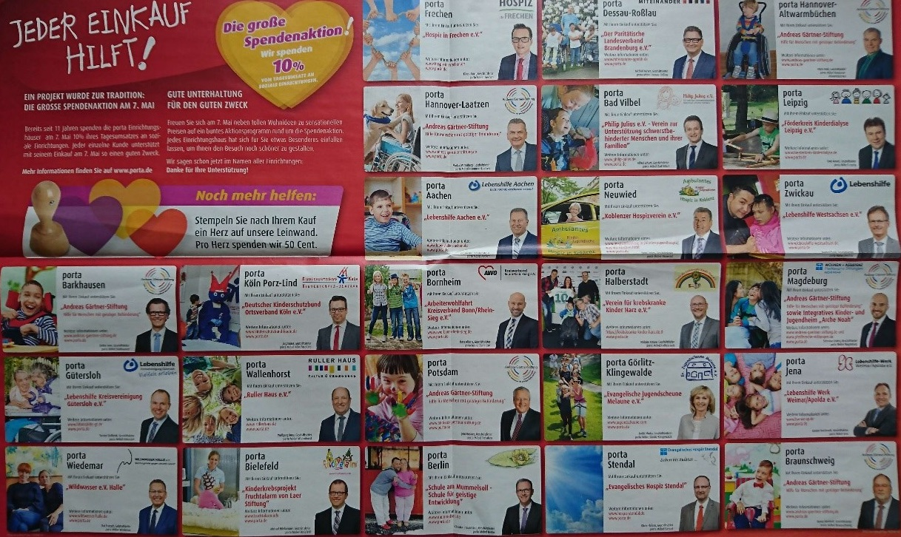

# Gliederung

## Gliederung

1. Einleitung
2. Gender Parität
3. Gender bias in der Wirtschaft
4. Gender bias in der Politik
5. Gender Bias in IT-relevanter Bildung
6. Gender bias in der IT-Branche
7. Zusammenfassung & Fazit

# 1 Einleitung

## 1.1 Definition Gender bias

> Gender bias beschreibt eine Geschlechterverzerrung, die von der angenommenen natürlichen Parität abweicht. 
> Also die Ungleichheit zwischen den Geschlechtern.

## 1.2 IT-Branche

#### IT-Branche:

- Informationstechnologie: alle Funktionen und Services für Informations- und Datenverarbeitung
- in 2019 weltweiter Umsatz von 2461,1 Mrd. US Dollar, in DE ca. 92.2 Mrd. Euro (Quelle: Bitcom)
- Aufteilung in Business-IT, Industrielle-IT, Kommunikations-IT, Unterhaltungs-IT
- Teil des Wirtschaftszweigs Information & Kommunikation

> IT-Branche als Begriff für diese Präsentation soll alle beschriebenen Branchen umfassen 
und die damit zusammenhängenden Berufe subsummieren.

#### Fokus Länder
- USA
- Deutschland

## 1.3 Frauen und IT (1/2)

### 1940er und 1950er

<style>
.container{
    display: flex;
}
.col{
    flex: 1;
}
</style>

<div class="container">

<div class="col">

#### ENIAC Girls

{ width=50% }

* 7 Mathematikerinnen, die den ersten elektronischen Universalrechner programmierten, inkl. Benutzerhandbuch und Demo Programm
* Marlyn Meltzer, Betty Holberton, Kathleen Antonelli, Ruth Teitelbaum, Jean Bartik und Frances Spence, Adele Goldstine

</div>

<div class="col">

#### NACA Computer

{ width=20% }

* Menschliche Computer bei der NACA (NASA): Annie Easley, Katherine Johnson and Kathryn Peddrew (Mathematikerinnen)

</div>

</div>


## 1.3 Frauen und IT (2/2)

<style>
.container{
    display: flex;
}
.col{
    flex: 1;
}
</style>

<div class="container">

<div class="col">
#### Grace Hopper

{ width=40% }

* Adminal bei der US Navy und Informatikerin: eine der ersten Programmiererinnen des Mark I Computers (Manhattan Project)
* leistete Vorarbeit für COBOL und basierend auf ihren Ideen wurde der erste Compiler entwickelt
</div>

<div class="col">
#### 1967 Cosmopolitan
{ width=61% }

* Software Developer als Beruf für die Frau in Lifestyle Magazin Cosmopolitan

</div>

</div>

## 1.4 Quellen und Methodik

Quellen:

* [world bank](http://datatopics.worldbank.org/gender/indicators)
* [world economic forum - Global Gender Gap Report](https://www.weforum.org/reports/the-global-gender-gap-report-2017)
* [OECD](https://www.oecd.org/gender/data/)
* [Eurostat](https://ec.europa.eu/eurostat/statistics-explained/index.php/Gender_statistics)
* [US Bureau of Labour Sta-titics](https://www.bls.gov/data/)
* [honeypot.io](https://www.honeypot.io/women-in-tech-2018/)
* [UN Statistik](https://genderstats.un.org/#/home)

Methodik:

* deskriptive Statistik auf Daten aus vorhandenen Quellen
* Tools: R, R markdown und reveal js, Word


# 2 Gender Parität 

## 2.1 Fisher Prinzip

nach Sir Ronald Aylmer Fisher, Genetiker & Statistiker:

> * erklärt die Gleichverteilung bei Arten mit gleich großen Weibchen und Männchen
 * "Generell formuliert ist dasjenige Verhältnis evolutiv stabil, bei dem der Fitness-Ertrag pro Investitionseinheit in Töchter bzw. Söhne gleich hoch ist." (Spektrum.de - Lexikon der Biologie) 

## 2.2 Aktuelle Geschlechterverteilung

<style>
.container{
    display: flex;
}
.col{
    flex: 1;
}
</style>

<div class="container">

<div class="col">
#### Geschlechterverteilung nach Kontinent

```{r Geschlechterverteilung, echo=FALSE, message=FALSE, warning=FALSE}
# 00 Pakete laden & Setup Grafisches Layout

library(tidyverse)
#install.packages("countrycode")
library(countrycode)
library(ggplot2)
#install.packages("ggthemes")
library(ggthemes)

library(gt)
library(glue)

#install.packages("webshot")
library(webshot)
#install_phantomjs()

# 01 Daten einlesen & erste Aufbereitung

setwd("C:/Users/dig/Desktop/Weiterbildung Data Science/Modul3 Storytelling/xx Hausarbeit/Quellen")

#-------------------------------------------------------------------------------------------------
#-------------------------------------------------------------------------------------------------

#-------------------------------------------------------------------------------------------------

# 01 population von UN Daten

population <- as_tibble(read.csv("Kapitel 03 Allgemein/population/Population_by_sex_UNdata_20190506_165023191.csv", stringsAsFactors = FALSE, na.strings = "..", fileEncoding = "UTF-8-BOM"))
population$Country.iso <- countrycode(sourcevar = population$Country.or.Area,origin =  'country.name', destination = 'iso3c')


population <- population %>%
  filter(Area == 'Total', Sex == 'Male' | Sex =='Female')%>%
  select(Country.iso,Country.or.Area,Year, Sex, Value)%>%
  rename(Country = Country.or.Area, Population_value = Value)%>%
  group_by(Country.iso, Country,Year,Sex)%>%
  summarise(Pop_value = max(Population_value) )%>%
  mutate(Continent=countrycode(sourcevar = Country.iso,origin = 'iso3c', destination = 'continent'))%>%
  mutate(Country.de=countrycode(sourcevar = Country.iso,origin = 'iso3c', destination = 'country.name.de'))


population$Country[population$Country.iso=='GBR'] <- 'United Kingdom'
#Kontinente eindeutschen

population$Continent.de[population$Continent=='Europe'] <- 'Europa'
population$Continent.de[population$Continent=='Asia'] <- 'Asien'
population$Continent.de[population$Continent=='Africa'] <- 'Afrika'
population$Continent.de[population$Continent=='Americas'] <- 'Amerika'
population$Continent.de[population$Continent=='Oceania'] <- 'Ozeanien'


#2.1 Bevölkerungsverteilung nach Geschlecht

pop2 <- population %>% 
  filter(Year == '2016')%>%
  group_by(Year,Sex, Country,Country.iso,Country.de,Continent, Continent.de)%>%
  summarise(Pop_value1 = max(Pop_value))%>%
  spread(Sex,Pop_value1)%>%
  mutate(Gesamt=Male+Female)%>%
  gather("Sex",Pop_value1,-c(Year,Country,Country.iso,Country.de,Gesamt,Continent, Continent.de))%>%
  mutate(Pop_value_percent = round(Pop_value1/Gesamt*100,1))%>%
  filter(Sex == 'Female')%>%
  arrange(desc(Pop_value_percent), Country)

pop2$Country.de[pop2$Country.de == 'Vereinigte Staaten'] = 'USA'

pop2$Pop_value_percent[pop2$Country.de == 'Litauen'] = 54.0

#Durchschnitt je Kontinent
Continent <- pop2 %>%
  filter(is.na(Continent) == FALSE )%>%
  group_by(Continent)%>%
  summarise(Durchschnitt_Kontinent=(sum(Pop_value1)/sum(Gesamt))*100)

#Durchschnitt Welt
world_mean <- population %>% 
  filter(Year == '2017')%>%
  group_by(Year,Sex)%>%
  summarise(Pop_value1 = sum(Pop_value)/1000000)%>%
  mutate(Pop_value_percent = Pop_value1/sum(Pop_value1)*100)%>%
  filter(Sex=="Female")%>%
  select(Pop_value_percent)
world_mean <- as.numeric(world_mean[1,2])

#Durchschnitt Europa
eu_mean<- as.numeric(Continent[Continent[1]=='Europe',2])  

#Durchschnitt DE
de <- as.numeric(na.omit((pop2$Pop_value1[pop2$Country.iso == 'DEU']/pop2$Gesamt[pop2$Country.iso == 'DEU'])*100))

#Durchschnitt USA
us <- as.numeric(na.omit((pop2$Pop_value1[pop2$Country.iso == 'USA']/pop2$Gesamt[pop2$Country.iso == 'USA'])*100))

pop2%>%
  na.omit(Continent)%>%
  filter(Sex=='Female', Year=='2016')%>%
  group_by(Continent.de,Sex)%>%
  summarize(v1 = mean(Pop_value_percent))%>%
  ggplot(mapping = aes(x=reorder(Continent.de,desc(v1)),y=v1, fill=Sex))+
  geom_col()+
  ylim(0, 100)+
  geom_hline(aes(yintercept = world_mean),color="red", linetype="dashed", size=1)+
  theme(legend.position = "none",axis.ticks=element_blank())+
  labs(title = "Anteil Frauen je Kontinent in Prozent",subtitle = "(2016)", caption = "Quelle: UN Statitik Daten zur Bevölkerung von data.un.org 2019")+
  scale_fill_manual(values = c("coral3"))+
  xlab(NULL)+
  ylab(NULL)+
  geom_text(aes(label = round(v1,1)),vjust = 1.5, colour = "white")

```
</div>

<div class="col">
#### Geschlechterverteilung Deutschland und USA

```{r Geschlechter USA und DE, echo=FALSE, message=FALSE, warning=FALSE}
# 00 Pakete laden & Setup Grafisches Layout

library(tidyverse)
#install.packages("countrycode")
library(countrycode)
library(ggplot2)
#install.packages("ggthemes")
library(ggthemes)

library(gt)
library(glue)

#install.packages("webshot")
library(webshot)
#install_phantomjs()

# 01 Daten einlesen & erste Aufbereitung

setwd("C:/Users/dig/Desktop/Weiterbildung Data Science/Modul3 Storytelling/xx Hausarbeit/Quellen")

#-------------------------------------------------------------------------------------------------
#-------------------------------------------------------------------------------------------------

#-------------------------------------------------------------------------------------------------

# 01 population von UN Daten

population <- as_tibble(read.csv("Kapitel 03 Allgemein/population/Population_by_sex_UNdata_20190506_165023191.csv", stringsAsFactors = FALSE, na.strings = "..", fileEncoding = "UTF-8-BOM"))
population$Country.iso <- countrycode(sourcevar = population$Country.or.Area,origin =  'country.name', destination = 'iso3c')


population <- population %>%
  filter(Area == 'Total', Sex == 'Male' | Sex =='Female')%>%
  select(Country.iso,Country.or.Area,Year, Sex, Value)%>%
  rename(Country = Country.or.Area, Population_value = Value)%>%
  group_by(Country.iso, Country,Year,Sex)%>%
  summarise(Pop_value = max(Population_value) )%>%
  mutate(Continent=countrycode(sourcevar = Country.iso,origin = 'iso3c', destination = 'continent'))%>%
  mutate(Country.de=countrycode(sourcevar = Country.iso,origin = 'iso3c', destination = 'country.name.de'))


population$Country[population$Country.iso=='GBR'] <- 'United Kingdom'
#Kontinente eindeutschen

population$Continent.de[population$Continent=='Europe'] <- 'Europa'
population$Continent.de[population$Continent=='Asia'] <- 'Asien'
population$Continent.de[population$Continent=='Africa'] <- 'Afrika'
population$Continent.de[population$Continent=='Americas'] <- 'Amerika'
population$Continent.de[population$Continent=='Oceania'] <- 'Ozeanien'


#2.1 Bevölkerungsverteilung nach Geschlecht

pop2 <- population %>% 
  filter(Year == '2016')%>%
  group_by(Year,Sex, Country,Country.iso,Country.de,Continent, Continent.de)%>%
  summarise(Pop_value1 = max(Pop_value))%>%
  spread(Sex,Pop_value1)%>%
  mutate(Gesamt=Male+Female)%>%
  gather("Sex",Pop_value1,-c(Year,Country,Country.iso,Country.de,Gesamt,Continent, Continent.de))%>%
  mutate(Pop_value_percent = round(Pop_value1/Gesamt*100,1))%>%
  filter(Sex == 'Female')%>%
  arrange(desc(Pop_value_percent), Country)

pop2$Country.de[pop2$Country.de == 'Vereinigte Staaten'] = 'USA'

pop2$Pop_value_percent[pop2$Country.de == 'Litauen'] = 54.0

#Durchschnitt je Kontinent
Continent <- pop2 %>%
  filter(is.na(Continent) == FALSE )%>%
  group_by(Continent)%>%
  summarise(Durchschnitt_Kontinent=(sum(Pop_value1)/sum(Gesamt))*100)

#Durchschnitt Welt
world_mean <- population %>% 
  filter(Year == '2017')%>%
  group_by(Year,Sex)%>%
  summarise(Pop_value1 = sum(Pop_value)/1000000)%>%
  mutate(Pop_value_percent = Pop_value1/sum(Pop_value1)*100)%>%
  filter(Sex=="Female")%>%
  select(Pop_value_percent)
world_mean <- as.numeric(world_mean[1,2])

#Durchschnitt Europa
eu_mean<- as.numeric(Continent[Continent[1]=='Europe',2])  

#Durchschnitt DE
de <- as.numeric(na.omit((pop2$Pop_value1[pop2$Country.iso == 'DEU']/pop2$Gesamt[pop2$Country.iso == 'DEU'])*100))

#Durchschnitt USA
us <- as.numeric(na.omit((pop2$Pop_value1[pop2$Country.iso == 'USA']/pop2$Gesamt[pop2$Country.iso == 'USA'])*100))

data.frame(Country.de=c("Deutschland", "USA"),Pop_value_percent=c(de,us), stringsAsFactors = F)%>%  
  # rbind(c("EU",eu_mean))%>%
  mutate(Pop_value_percent = as.numeric(Pop_value_percent))%>%
  ggplot(mapping = aes(x=reorder(Country.de,Pop_value_percent),y=Pop_value_percent))+
  geom_col(fill=("coral3"))+
  ylim(0, 100)+
  geom_hline(aes(yintercept = world_mean,linetype="Weltweiter Durchschnitt"),color="red",  size=1)+
  theme(legend.position = "bottom", legend.title = element_blank(),axis.ticks=element_blank(),legend.key.width = unit(1,"cm"))+
  labs(title = "Anteil Frauen in Prozent",subtitle = "(2016)",
       caption = "Quelle: UN Statitik Daten zur Bevölkerung von data.un.org 2019")+
  xlab(NULL)+
  ylab(NULL)+
  geom_text(aes(label = round(Pop_value_percent,1)),vjust = 1.5, colour = "white")+
  scale_linetype_manual(values = c(2, 1),
                        guide = guide_legend(override.aes = list(color = c("red"))))
```
</div>

</div>

## 2.3 Global Gender Index (1/2)
```{r echo=FALSE, message=FALSE, warning=FALSE, fig.width=5,fig.height=5}
library(tidyverse)
#install.packages("countrycode")
library(countrycode)
library(ggplot2)
library(ggthemes)

library(ggmap)
library(dplyr)
library(grid)
library(rworldmap)

library(gt)
library(glue)
library(stringr)

setwd("C:/Users/dig/Desktop/Weiterbildung Data Science/Modul3 Storytelling/xx Hausarbeit/Quellen")


global_gender_i <- as_tibble(read.csv("Kapitel 03 Allgemein/world economic forum - global gender gap/data.csv", stringsAsFactors = FALSE, na.strings = ".."))
#Spalten umbennen & tidy up
global_gender_i <- global_gender_i%>%
  rename(Country.iso = Country.ISO3,Country=Country.Name,Indicator.Code = Indicator.Id,
         '2006' = X2006,
         '2007' = X2007,
         '2008' = X2008,
         '2009' = X2009,
         '2010' = X2010,
         '2011' = X2011,
         '2012' = X2012,
         '2013' = X2013,
         '2014' = X2014,
         '2015' = X2015,
         '2016' = X2016,
         '2018' = X2018
  )%>%
  gather("Time","Indicator.Value",-c(Country.iso,Country,Indicator.Code,Indicator,Subindicator.Type))%>%
  mutate(Continent=countrycode(sourcevar = Country.iso,origin = 'iso3c', destination = 'continent'))%>%
  #  filter(is.na(Continent) == FALSE)%>%
  mutate(Country.de=countrycode(sourcevar = Country.iso,origin = 'iso3c', destination = 'country.name.de'))

global_gender_i$Continent.de[global_gender_i$Continent=='Europe'] <- 'Europa'
global_gender_i$Continent.de[global_gender_i$Continent=='Asia'] <- 'Asien'
global_gender_i$Continent.de[global_gender_i$Continent=='Africa'] <- 'Afrika'
global_gender_i$Continent.de[global_gender_i$Continent=='Americas'] <- 'Amerika'
global_gender_i$Continent.de[global_gender_i$Continent=='Oceania'] <- 'Ozeanien'

global_gender_i$Country.de[global_gender_i$Country.iso=='USA'] <- 'USA'

global_gender_i_overall_rank <- global_gender_i%>%
  filter(Indicator == 'Overall Global Gender Gap Index', Subindicator.Type == 'Rank')%>%
  select(Continent.de,Country.de,Year=Time,Value =Indicator.Value)


global_gender_i_overall <- global_gender_i%>%
  filter(Indicator == 'Overall Global Gender Gap Index', Subindicator.Type == 'Index')%>%
  select(Continent.de,Country.de,Year=Time,Value =Indicator.Value)

Durchschnitt_je_Kontinent <- global_gender_i_overall%>%
  filter(is.na(Value) == FALSE)%>%
  group_by(Continent.de, Year)%>%
  summarise(Value = mean(Value))%>%
  rename(Gruppe=Continent.de)

Durchschnitt_Welt <- global_gender_i_overall%>%
  filter(is.na(Value) == FALSE)%>%
  group_by(Year)%>%
  summarise(Value = mean(Value))%>%
  mutate(Gruppe='Welt')%>%
  select(Gruppe,Year,Value)

DE <-global_gender_i_overall%>%
  filter(Country.de==c("Deutschland"))%>%
  select(Country.de,Year,Value)%>%
  rename(Gruppe=Country.de)

US <-global_gender_i_overall%>%
  filter(Country.de==c("USA"))%>%
  select(Country.de,Year,Value)%>%
  rename(Gruppe=Country.de)

Durchschnitt_DE_US_Kontinent_Welt <- bind_rows(DE,US,Durchschnitt_je_Kontinent,Durchschnitt_Welt)

tabelle3 <-  global_gender_i_overall_rank%>%
  filter(Year=='2006' | Year=='2018', Country.de == 'Deutschland' | Country.de == 'USA'| Country.de == 'Island'|Country.de == 'Schweden'|Country.de == 'Norwegen')%>%
  spread(Year,Value)%>%
  rename(Kontinent=Continent.de,Land=Country.de,'Rank 2006' =`2006`,'Rank 2018'=`2018`)%>%
  arrange(`Rank 2018`)%>% 
  cbind('Index 2006'=c(0.7813,0.7994,0.8133,0.7524,0.7042))%>% 
  cbind('Index 2018'=c(0.8580,0.8350,0.8220,0.7760,0.7200))%>%
  mutate(`Index 2018`=as.numeric(`Index 2018`),`Index 2006`=as.numeric(`Index 2006`))


tab_kap3_3 <- tabelle3%>%
  select(Kontinent,Land,`Rank 2018`,`Index 2018`,`Rank 2006`,`Index 2006`)%>%
  rename(`Rang 2018` = `Rank 2018`,`Rang 2006` = `Rank 2006`)%>%
  gt()%>%
  tab_header(
    title = "Global Gender Gap Index & Rank 2018/2006",subtitle = "Top3 2018, Deutschland, USA")%>%
  tab_source_note(source_note = "Quelle: world economic forum - global gender gap report 2017")%>%
  fmt_number(columns = vars(`Index 2006`),  suffixing = FALSE, decimals = 2,scale_by = 1)%>%
  fmt_number(columns = vars(`Index 2018`),  suffixing = FALSE, decimals = 2,scale_by = 1)

tab_kap3_3
```


* stellt die Geschlechterlücke dar anhand von 14 Indikatoren aus vier grundlegenden Bereichen: Wirtschaftliche Gleichstellung, Zugang zur Bildung,  Gesundheit und Lebenserwartung und Politische Beteiligung.
<br>

* Deutschland und die USA rutschten innerhalb von 12 Jahren auf der Rangliste ab, obwohl sich nominell der Index verbesserte: (Deutschland von Platz 5 auf 14, USA von Platz 23 auf 51)

## 2.3 Global Gender Index (2/2)


```{r echo=FALSE, message=FALSE, warning=FALSE, fig.width=5,fig.height=5}
Durchschnitt_DE_US_Kontinent_Welt%>%
  filter(Gruppe==('Deutschland') |Gruppe==('Welt')| Gruppe==('USA') )%>%
  ggplot(mapping = aes(x=Year,y=Value, color=Gruppe))+
    geom_line(aes(group = Gruppe))+
    scale_color_manual(values = c("Deutschland" = "red",
                                           "USA" ="grey37",
                                           "Welt" ="green"))+
    ylim(0.0,0.9)+
    theme(legend.title=element_blank(),legend.position = "bottom",axis.ticks=element_blank())+
    labs(title = "Global Gender Gap Index",subtitle = "(2006 bis 2018)",
         caption = "Quelle: world economic forum - global gender gap report 2017")+
    xlab(NULL)+
    ylab(NULL)
```

* weltweit steigt der Index leicht 
* in den USA und Deutschland stagniert der Index

# 3 Gender bias in der Wirtschaft

## 3.1 Anteil der arbeitenden Frauen an den arbeitsfähigen Frauen


```{r echo=FALSE, message=FALSE, warning=FALSE}
library(tidyverse)
#install.packages("countrycode")
library(countrycode)
library(ggplot2)
library(ggthemes)

library(ggmap)
library(dplyr)
library(grid)
library(rworldmap)

library(gt)
library(glue)
library(stringr)

setwd("C:/Users/dig/Desktop/Weiterbildung Data Science/Modul3 Storytelling/xx Hausarbeit/Quellen")

# Verteilungen der Frauen in der Arbeitswelt
#---------------------------------------
# 04 Anteil Frauen/Männer an Arbeitskraft oecd:

#Arbeitswelt Zahlen - Jahr 2018
labour_force_data <- as_tibble(read.csv("Kapitel 04 Arbeitswelt/oecd/Labour_Force_Data_24052019093824679.csv", stringsAsFactors = FALSE, fileEncoding = "UTF-8-BOM", header = TRUE))%>%
  select(COUNTRY,Country,Sex,Age,Series,Time,PowerCode, Value)%>%
  rename(Country.iso = COUNTRY)%>%
  filter(Sex != 'All persons')%>%
  #Kontinent&Land in Deutsch hinzufügen
  mutate(Continent=countrycode(sourcevar = Country.iso,origin = 'iso3c', destination = 'continent'))%>%
  mutate(Country.de=countrycode(sourcevar = Country.iso,origin = 'iso3c', destination = 'country.name.de'))%>%
  filter(is.na(Continent) == FALSE)

#Kontinent auf Deutsch
labour_force_data$Continent.de[labour_force_data$Continent=='Europe'] <- 'Europa'
labour_force_data$Continent.de[labour_force_data$Continent=='Asia'] <- 'Asien'
labour_force_data$Continent.de[labour_force_data$Continent=='Africa'] <- 'Afrika'
labour_force_data$Continent.de[labour_force_data$Continent=='Americas'] <- 'Amerika'
labour_force_data$Continent.de[labour_force_data$Continent=='Oceania'] <- 'Ozeanien'

labour_force_data$Country.de[labour_force_data$Country.iso=='USA'] <- 'USA'


labor_force_data.berbeitet<-labour_force_data%>%
  filter((Continent == 'Europe' | Country.iso == 'USA') & Time=='2017' & Age == 'Total')%>% 
  spread(Series,Value)%>%
  mutate(Anteil_arbeitsfähiger_an_Gesamtgeschlecht = `Labour Force`/`Population`)%>%
  mutate(Anteil_arbeitender_an_arbeitsfähigenGeschlecht = `Employment`/`Labour Force`)%>%
  select(Country.de,Sex,Anteil_arbeitsfähiger_an_Gesamtgeschlecht,Anteil_arbeitender_an_arbeitsfähigenGeschlecht)


labor_force_data.berbeitet_m <- labor_force_data.berbeitet%>%
  filter(Sex=='Men')

labor_force_data.berbeitet_F <- labor_force_data.berbeitet%>%
  filter(Sex=='Women')

labor_force_data.berbeitet.01<-inner_join(labor_force_data.berbeitet_F,labor_force_data.berbeitet_m,c("Country.de" = "Country.de"))

labor_force_data.berbeitet.02<-labor_force_data.berbeitet.01%>%rename(Anteil_arbeitenderFrauen_an_arbeitsfähigenFrauen=Anteil_arbeitender_an_arbeitsfähigenGeschlecht.x,
                                                                      Anteil_arbeitsfähigerFrauen_an_GesamtFrauen=Anteil_arbeitsfähiger_an_Gesamtgeschlecht.x,
                                                                      Anteil_arbeitenderMänner_an_arbeitsfähigenMännern=Anteil_arbeitender_an_arbeitsfähigenGeschlecht.y,
                                                                      Anteil_arbeitsfähigerMänner_an_GesamtMännern=Anteil_arbeitsfähiger_an_Gesamtgeschlecht.y)

lab_col08 <- c(rep("black",22),"red",rep("black",3),"red","black")

ggplot(labor_force_data.berbeitet.02) +
  geom_segment( aes(x=reorder(Country.de,(Anteil_arbeitenderFrauen_an_arbeitsfähigenFrauen)), xend=Country.de, y=Anteil_arbeitenderFrauen_an_arbeitsfähigenFrauen*100, yend=Anteil_arbeitenderMänner_an_arbeitsfähigenMännern*100), color="black") +
  geom_point( aes(x=Country.de, y=Anteil_arbeitenderFrauen_an_arbeitsfähigenFrauen*100, color='coral3'), size=3 ) +
  geom_point( aes(x=Country.de, y=Anteil_arbeitenderMänner_an_arbeitsfähigenMännern*100, color='blue4'), size=3 ) +
  coord_flip()+ 
  xlab(NULL) +
  ylab("Prozent")+
  labs(title = "Anteil Arbeiter an Arbeitsfähigen nach Geschlecht", subtitle = "OECD Länder (2017)", caption = "Quelle: OECD - Labour force data 2017")+
  scale_colour_manual(name = 'the colour', values =c('coral3'='coral3','blue4'='blue4'), labels = c('Anteil arbeitende Frauen\nan arbeitsfähigen Frauen','Anteil arbeitende Männer\nan arbeitsfähigen Männer'))+
  theme(legend.title=element_blank(),legend.position = "bottom",axis.ticks=element_blank() )+
  ylim(0,100)+
  annotate("text", x=27, y=90, label= "96.6%") + 
  annotate("text", x=23, y=90, label= "95.6%") + 
  annotate("rect", xmin = 17, xmax = 23, ymin = 15, ymax = 84,  alpha = .9, fill="white")+
  annotate("text", x = 20 , y = 50, label = "Beide Geschlechter nehmen in den USA und\nDeutschland in gleicher Weise am Arbeitsmarkt teil")+
  theme(axis.text.y = element_text(colour = lab_col08))
```


## 3.2 Management und Aufsichtsrat (1/2)

<style>
.container{
    display: flex;
}
.col{
    flex: 1;
}
</style>

<div class="container">

<div class="col">

```{r echo=FALSE, message=FALSE, warning=FALSE}
################################################
#
# Kapitel: 4 Arbeitswelt
#
################################################
# 00 Pakete laden & und Working directory festlegen

library(tidyverse)
#install.packages("countrycode")
library(countrycode)
library(ggplot2)
library(ggthemes)

library(ggmap)
library(dplyr)
library(grid)
library(rworldmap)

library(gt)
library(glue)
library(stringr)

setwd("C:/Users/dig/Desktop/Weiterbildung Data Science/Modul3 Storytelling/xx Hausarbeit/Quellen")

# 05 Anteil Frauen an Manager Positionen:

share_fem_manager <-as_tibble(read.csv("Kapitel 04 Arbeitswelt/oecd/Share of employed who are managers, by sex.csv", stringsAsFactors = FALSE, fileEncoding = "UTF-8-BOM", header = TRUE))%>%
  select(COU,Country,Indicator,Sex,Time,Unit,Value)%>%
  rename(Country.iso = COU, Year = Time)%>%
  mutate(Continent=countrycode(sourcevar = Country.iso,origin = 'iso3c', destination = 'continent'))%>%
  mutate(Country.de=countrycode(sourcevar = Country.iso,origin = 'iso3c', destination = 'country.name.de'))
#Kontinent und Land bearbeiten
share_fem_manager$Continent.de[share_fem_manager$Continent=='Europe'] <- 'Europa'
share_fem_manager$Continent.de[share_fem_manager$Continent=='Asia'] <- 'Asien'
share_fem_manager$Continent.de[share_fem_manager$Continent=='Africa'] <- 'Afrika'
share_fem_manager$Continent.de[share_fem_manager$Continent=='Americas'] <- 'Amerika'
share_fem_manager$Continent.de[share_fem_manager$Continent=='Oceania'] <- 'Ozeanien'
share_fem_manager$Country.de[share_fem_manager$Country.iso=='USA'] <- 'USA'

share_fem_board_members <-as_tibble(read.csv("Kapitel 04 Arbeitswelt/oecd/Female share of seats on boards of the largest publicly listed companies.csv", stringsAsFactors = FALSE, fileEncoding = "UTF-8-BOM", header = TRUE))%>%
  select(COU,Country,Indicator,Sex,Time,Unit,Value)%>%
  rename(Country.iso = COU, Year = Time)%>%
  mutate(Continent=countrycode(sourcevar = Country.iso,origin = 'iso3c', destination = 'continent'))%>%
  mutate(Country.de=countrycode(sourcevar = Country.iso,origin = 'iso3c', destination = 'country.name.de'))
#Kontinent und Land bearbeiten
share_fem_board_members$Continent.de[share_fem_board_members$Continent=='Europe'] <- 'Europa'
share_fem_board_members$Continent.de[share_fem_board_members$Continent=='Asia'] <- 'Asien'
share_fem_board_members$Continent.de[share_fem_board_members$Continent=='Africa'] <- 'Afrika'
share_fem_board_members$Continent.de[share_fem_board_members$Continent=='Americas'] <- 'Amerika'
share_fem_board_members$Continent.de[share_fem_board_members$Continent=='Oceania'] <- 'Ozeanien'
share_fem_board_members$Country.de[share_fem_board_members$Country.iso=='USA'] <- 'USA'


share_fem_manager_01 <- share_fem_manager%>%
  filter((Continent == 'Europe' | Country.iso == 'USA') & Year=='2017')%>%
  select(Country.de,Year,Sex,Value)%>%
  spread(Sex,Value)%>%
  mutate(Total=Men+Women)%>%
  mutate(Anteil_Frauen_Management = round((Women/Total)*100,1))

share_fem_manager_02 <- share_fem_manager%>%
  filter((Continent == 'Europe' | Country.iso == 'USA'))%>%
  select(Country.de,Year,Sex,Value)%>%
  spread(Sex,Value)%>%
  mutate(Total=Men+Women)%>%
  mutate(Value = round((Women/Total)*100,1))

lab_col07 <- c(rep("black",3),"red",rep("black",17),"red",rep("black",4))

share_fem_manager_01%>%
  ggplot(mapping = aes(x=reorder(Country.de,Anteil_Frauen_Management),y=Anteil_Frauen_Management))+
  geom_col(fill="coral3")+
  ylim(0, 75)+
  xlab(NULL)+
  ylab(NULL)+
  labs(title = "Anteil Frauen im Management",subtitle = "OECD Länder (2017)",caption = "Quelle: OECD - Indikator Share of employed, whoi are managers 2017")+
  geom_text(aes(label=Anteil_Frauen_Management), hjust = 1.2, colour="white")+
  coord_flip()+
  theme(axis.text.y = element_text(colour = lab_col07))
```

</div>

<div class="col">

```{r echo=FALSE, message=FALSE, warning=FALSE}
library(tidyverse)
#install.packages("countrycode")
library(countrycode)
library(ggplot2)
library(ggthemes)

library(ggmap)
library(dplyr)
library(grid)
library(rworldmap)

library(gt)
library(glue)
library(stringr)

setwd("C:/Users/dig/Desktop/Weiterbildung Data Science/Modul3 Storytelling/xx Hausarbeit/Quellen")

# 05 Anteil Frauen an Manager Positionen:

share_fem_manager <-as_tibble(read.csv("Kapitel 04 Arbeitswelt/oecd/Share of employed who are managers, by sex.csv", stringsAsFactors = FALSE, fileEncoding = "UTF-8-BOM", header = TRUE))%>%
  select(COU,Country,Indicator,Sex,Time,Unit,Value)%>%
  rename(Country.iso = COU, Year = Time)%>%
  mutate(Continent=countrycode(sourcevar = Country.iso,origin = 'iso3c', destination = 'continent'))%>%
  mutate(Country.de=countrycode(sourcevar = Country.iso,origin = 'iso3c', destination = 'country.name.de'))
#Kontinent und Land bearbeiten
share_fem_manager$Continent.de[share_fem_manager$Continent=='Europe'] <- 'Europa'
share_fem_manager$Continent.de[share_fem_manager$Continent=='Asia'] <- 'Asien'
share_fem_manager$Continent.de[share_fem_manager$Continent=='Africa'] <- 'Afrika'
share_fem_manager$Continent.de[share_fem_manager$Continent=='Americas'] <- 'Amerika'
share_fem_manager$Continent.de[share_fem_manager$Continent=='Oceania'] <- 'Ozeanien'
share_fem_manager$Country.de[share_fem_manager$Country.iso=='USA'] <- 'USA'

share_fem_board_members <-as_tibble(read.csv("Kapitel 04 Arbeitswelt/oecd/Female share of seats on boards of the largest publicly listed companies.csv", stringsAsFactors = FALSE, fileEncoding = "UTF-8-BOM", header = TRUE))%>%
  select(COU,Country,Indicator,Sex,Time,Unit,Value)%>%
  rename(Country.iso = COU, Year = Time)%>%
  mutate(Continent=countrycode(sourcevar = Country.iso,origin = 'iso3c', destination = 'continent'))%>%
  mutate(Country.de=countrycode(sourcevar = Country.iso,origin = 'iso3c', destination = 'country.name.de'))
#Kontinent und Land bearbeiten
share_fem_board_members$Continent.de[share_fem_board_members$Continent=='Europe'] <- 'Europa'
share_fem_board_members$Continent.de[share_fem_board_members$Continent=='Asia'] <- 'Asien'
share_fem_board_members$Continent.de[share_fem_board_members$Continent=='Africa'] <- 'Afrika'
share_fem_board_members$Continent.de[share_fem_board_members$Continent=='Americas'] <- 'Amerika'
share_fem_board_members$Continent.de[share_fem_board_members$Continent=='Oceania'] <- 'Ozeanien'
share_fem_board_members$Country.de[share_fem_board_members$Country.iso=='USA'] <- 'USA'


share_fem_manager_01 <- share_fem_manager%>%
  filter((Continent == 'Europe' | Country.iso == 'USA') & Year=='2017')%>%
  select(Country.de,Year,Sex,Value)%>%
  spread(Sex,Value)%>%
  mutate(Total=Men+Women)%>%
  mutate(Anteil_Frauen_Management = round((Women/Total)*100,1))

share_fem_manager_02 <- share_fem_manager%>%
  filter((Continent == 'Europe' | Country.iso == 'USA'))%>%
  select(Country.de,Year,Sex,Value)%>%
  spread(Sex,Value)%>%
  mutate(Total=Men+Women)%>%
  mutate(Value = round((Women/Total)*100,1))

lab_col06 <- c(rep("black",13),"red",rep("black",7),"red",rep("black",6))

share_fem_board_members%>%
  filter((Continent == 'Europe' | Country.iso == 'USA') & Year=='2017')%>%
  ggplot(mapping = aes(x=reorder(Country.de,Value),y=Value))+
  geom_bar(stat="identity", fill="coral3")+
  theme(legend.position = "none")+
  ylim(0, 50)+
  xlab(NULL)+
  ylab(NULL)+
  labs(title = "Anteil Frauen im Aufsichtsrat",subtitle =  "OECD Länder (2017)",caption = "Quelle: OECD - Indikator Female share on boards 2017")+
  geom_text(aes(label=Value), hjust = 1.2, colour="white")+
  coord_flip()+
  theme(axis.text.y = element_text(colour = lab_col06))
```
</div>

</div>

* der Frauenanteil im Management liegt in den USA mit 43.6% deutlich höher als in Deutschland (32.2%)
* hingegen im Aufsichtsrat sind in den deutschen Unternehmen mit knapp 32 % mehr Frauen als in den USA (21.7%) vertreten

## 3.2 Management und Aufsichtsrat im Zeitverlauf (2/2)

```{r echo=FALSE, message=FALSE, warning=FALSE, fig.height=5, fig.width=5}
#Verlauf Manager und Board Members DE & USA

share_frauen_in_management_board<-rbind(
share_fem_board_members%>%
  filter(Country.iso == 'DEU' | Country.iso == 'USA')%>%
  select(Country.de,Year,Value)%>%
  mutate(Indicator='Anteil\nFrauen im Aufsichtsrat'),
share_fem_manager_02%>%
  filter(Country.de == 'Deutschland' | Country.de == 'USA')%>%
  select(Country.de,Year,Value)%>%
  mutate(Indicator='Anteil\nManagerinnen'))

share_frauen_in_management_board%>%
ggplot(mapping = aes(x=Year,y=Value, color=Indicator))+
  geom_line(aes(group = Indicator))+
  theme(legend.title=element_blank(),legend.position = "bottom",axis.ticks=element_blank())+
  ggtitle("")+
  xlab("Jahr")+
  ylab("Prozent")+
  facet_grid(Country.de~.)+
  labs(title = "Anteil Frauen im Aufsichtsrat & im Management",subtitle = "Deutschland und USA (2010 bis 2016)",caption = "Quelle: OECD - Indikator Female share on boards & Management 2017")
```

* in Deutschland für Aufsichtsräte: Gesetz für die gleichberechtigte Teilhabe von Frauen und Männern an Führungspositionen (gültig seit 01/01/2016)
* keine Abstrahleffekte auf Management-Positionen

## 3.3 Karriereleiter

```{r echo=FALSE, message=FALSE, warning=FALSE}
################################################
#
# Kapitel: 4 Arbeitswelt
#
################################################
# 00 Pakete laden & und Working directory festlegen

library(tidyverse)
#install.packages("countrycode")
library(countrycode)
library(ggplot2)
library(ggthemes)

library(ggmap)
library(dplyr)
library(grid)
library(rworldmap)

library(gt)
library(glue)
library(stringr)

setwd("C:/Users/dig/Desktop/Weiterbildung Data Science/Modul3 Storytelling/xx Hausarbeit/Quellen")

pipeline_women_workplace <- read.csv2("Kapitel 05 Gender bias in IT/US_company_pipeline_Distribution of employees_by_gender_overall.csv", stringsAsFactors = FALSE,quote = ",")%>%
  mutate(Rank=c(6,5,4,3,2,1))%>%
  gather(Sex, Value,-c(Karriere.Stufe,Rank))%>%
  mutate(Value = as.double(Value))%>%
  mutate(Value = case_when(Sex == 'Männer' ~ Value, 
                           Sex == 'Frauen' ~ Value*-1))

brks <- seq(-100, 100, 25)
lbs <- c(seq(100,0,-25),seq(25,100,25))

pipeline_women_workplace%>%
  ggplot(aes(x = reorder(Karriere.Stufe,Rank), y = Value, fill = Sex)) +   # Fill column
  geom_bar(stat = "identity", width = .6) +   # draw the bars
  scale_y_continuous(breaks = brks,
                     labels = lbs)+   # Breaks + # Labels
  coord_flip() +  # Flip axes
  labs(title="Anteil Frauen/Männer je Karriere-Stufe", subtitle = "USA (2018)", caption = "Quelle: McKinsey/Lean IN- woman in workplace Report 2018") +
  theme(axis.ticks = element_blank(), legend.position = 'bottom', legend.title = element_blank(),
        panel.grid.major = element_blank(),
        panel.grid.minor = element_blank(),
        panel.background = element_blank(),
        axis.text.x = element_blank()
  ) +  
  scale_fill_manual(values = c("Frauen"="coral3", "Männer"="blue4"),labels = c("Anteil Frauen", "Anteil Männer"))+
  xlab(NULL)+
  ylab(NULL)+
  geom_text(aes(label=abs(Value),hjust= ifelse(Value >= 0, 1.2, -0.2) ),colour="white", size = 3)


```

## 3.4 Gender Pay Gap (unbereinigt)

```{r echo=FALSE, message=FALSE, warning=FALSE,fig.height=5,fig.width=5}
################################################
#
# Kapitel: 4 Arbeitswelt
#
################################################
# 00 Pakete laden & und Working directory festlegen

library(tidyverse)
#install.packages("countrycode")
library(countrycode)
library(ggplot2)
library(ggthemes)

library(ggmap)
library(dplyr)
library(grid)
library(rworldmap)

library(gt)
library(glue)
library(stringr)

setwd("C:/Users/dig/Desktop/Weiterbildung Data Science/Modul3 Storytelling/xx Hausarbeit/Quellen")

g_pay_gap <- as_tibble(read.csv("Kapitel 04 Arbeitswelt/oecd - Gender pay gap/GENDER_EMP_16052019100552589.csv", stringsAsFactors = FALSE, fileEncoding = "UTF-8-BOM"))%>%
  select(c(COU,Country,Indicator,Time,Unit,Value))%>%
  rename(Country.iso = COU)%>%
  #Kontinent&Land in Deutsch hinzufügen
  mutate(Continent=countrycode(sourcevar = Country.iso,origin = 'iso3c', destination = 'continent'))%>%
  mutate(Country.de=countrycode(sourcevar = Country.iso,origin = 'iso3c', destination = 'country.name.de'))%>%
  filter(is.na(Continent) == FALSE)

#Kontinent auf Deutsch
g_pay_gap$Continent.de[g_pay_gap$Continent=='Europe'] <- 'Europa'
g_pay_gap$Continent.de[g_pay_gap$Continent=='Asia'] <- 'Asien'
g_pay_gap$Continent.de[g_pay_gap$Continent=='Africa'] <- 'Afrika'
g_pay_gap$Continent.de[g_pay_gap$Continent=='Americas'] <- 'Amerika'
g_pay_gap$Continent.de[g_pay_gap$Continent=='Oceania'] <- 'Ozeanien'

g_pay_gap$Country.de[g_pay_gap$Country.iso=='USA'] <- 'USA'

g_pay_gap%>%
  filter(Country.iso == c("DEU") | Country.iso == c("USA"))%>%
  filter(`Time` > 2005)%>%
  ggplot(mapping = aes(x=Time,y=Value, color=Country.de))+
  geom_line(aes(group = Country.de))+
  #  facet_grid(Gruppe ~.)+
  ylim(0,40)+
  theme(legend.title=element_blank(),legend.position = "bottom",axis.ticks=element_blank())+
  labs(title= "Entwicklung Gender pay gap", subtitle = "für Deutschland und USA (2010 bis 2017)", caption = "Quelle: OECD - Gender Pay Gap")+
  xlab("Jahr")+
  ylab(NULL)+
  scale_colour_manual(name = 'the colour', values =c('Deutschland'='coral3','USA'='grey37'), labels = c('Deutschland','USA'))


```

* unbereinigter Gender Pay Gap: misst die prozentuale Differenz zwischen Bruttover-diensten von Frauen und Männern
* Entwicklung stagniert


## 3.5 Beispiel Gender bias in der Wirtschaft


<center>
{ width=90% }
</center>

* 1 Frau unter 24 Geschäftsführern

# 4 Gender bias in der Politik

## 4.1 Anteil Frauen im Parlamenten und Ministerien

<style>
.container{
    display: flex;
}
.col{
    flex: 1;
}
</style>

<div class="container">

<div class="col">
```{r echo=FALSE, message=FALSE, warning=FALSE}
library(tidyverse)
#install.packages("countrycode")
library(countrycode)
library(ggplot2)
library(ggthemes)

library(ggmap)
library(dplyr)
library(grid)
library(rworldmap)

library(gt)
library(glue)
library(stringr)

setwd("C:/Users/dig/Desktop/Weiterbildung Data Science/Modul3 Storytelling/xx Hausarbeit/Quellen")

# 06 world bank: Anteil Frauen an Parlamenten, in Ministerien

worldbank_indicators_data <- as_tibble(read.csv("Kapitel 04 Arbeitswelt/worldbank/63f1783b-e916-42ff-8826-d67688420843_Data.csv", stringsAsFactors = FALSE, fileEncoding = "UTF-8-BOM", header = TRUE, na.strings = '..'))%>%
  rename(Indicator=Series.Name,
         '2009' = X2009..YR2009.,
         '2010' = X2010..YR2010.,
         '2011' = X2011..YR2011.,
         '2012' = X2012..YR2012.,
         '2013' = X2013..YR2013.,
         '2014' = X2014..YR2014.,
         '2015' = X2015..YR2015.,
         '2016' = X2016..YR2016.,
         '2017' = X2017..YR2017.,
         '2018' = X2018..YR2018.,
         Country=Country.Name,
         Country.iso=Country.Code
  )%>%
  gather(Years,Value,-c(Indicator,Country.iso,Country,Series.Code))%>%
  mutate(Continent=countrycode(sourcevar = Country.iso,origin = 'iso3c', destination = 'continent'))%>%
  mutate(Country.de=countrycode(sourcevar = Country.iso,origin = 'iso3c', destination = 'country.name.de'))
#Kontinent und Land bearbeiten
worldbank_indicators_data$Continent.de[worldbank_indicators_data$Continent=='Europe'] <- 'Europa'
worldbank_indicators_data$Continent.de[worldbank_indicators_data$Continent=='Asia'] <- 'Asien'
worldbank_indicators_data$Continent.de[worldbank_indicators_data$Continent=='Africa'] <- 'Afrika'
worldbank_indicators_data$Continent.de[worldbank_indicators_data$Continent=='Americas'] <- 'Amerika'
worldbank_indicators_data$Continent.de[worldbank_indicators_data$Continent=='Oceania'] <- 'Ozeanien'
worldbank_indicators_data$Country.de[worldbank_indicators_data$Country.iso=='USA'] <- 'USA'


#worldbank_indicators_definition <- as_tibble(read.csv("Kapitel 04 Arbeitswelt/worldbank/63f1783b-e916-42ff-8826-d67688420843_Definition and Source.csv", stringsAsFactors = FALSE, fileEncoding = "UTF-8-BOM", header = TRUE, na.strings = '..'))


share_fem_parlament_2018 <- filter(worldbank_indicators_data,Series.Code=='SG.GEN.PARL.ZS')%>%
  select(Indicator,Country.iso,Country.de,Continent.de, Years, Value)%>%
  filter(Years==2018)%>%
  arrange(desc(Value))

share_fem_parlament_2018 <- share_fem_parlament_2018[is.na(share_fem_parlament_2018$Value)==FALSE,]%>%
  mutate(ranking = min_rank(desc(Value)))


#Gesamt:
share_fem_parlament_2018_Top5_tail5_USA_DE<- rbind(head(share_fem_parlament_2018,3),
                                                   # c('..','..','..','..','..','',''),
                                                   filter(share_fem_parlament_2018, Country.iso == 'DEU'),
                                                   # c('..','..','..','..','..','',''),
                                                   filter(share_fem_parlament_2018, Country.iso == 'USA')
                                                   #c('..','..','..','..','..','',''),
                                                   #tail(share_fem_parlament_2018,3)
)

tabelle3 <- share_fem_parlament_2018_Top5_tail5_USA_DE%>%
  select(Country.de, Continent.de,ranking,Value)%>%
  rename(Land=Country.de, Kontinent = Continent.de, Rank=ranking, 'Anteil in %' = Value)


tab_kap4_2 <- tabelle3 %>%
  gt()%>%
  tab_header(
    title = "Anteil Frauen in Parlamenten (2018)",
    subtitle = "Top 3, Deutschland & USA von 239 Ländern")%>%
  tab_source_note(source_note = "Quelle: world bank - Indikator share of parlament 2018")

tab_kap4_2
```


</div>

<div class="col">
```{r echo=FALSE, message=FALSE, warning=FALSE}
## Minister
share_fem_minister <- filter(worldbank_indicators_data,Series.Code=='SG.GEN.MNST.ZS')%>%
  select(Indicator,Country.iso,Country.de,Continent.de, Years, Value)%>%
  filter(Years %in% c('2017','2016','2015'))%>%
  arrange(desc(Value))

share_fem_minister<-share_fem_minister[is.na(share_fem_minister$Value) == FALSE,] 

Land_Jahr <- group_by(share_fem_minister,Country.de)%>%
  summarise(Year=max(Years))

share_fem_minister.01 <- na.omit(inner_join(share_fem_minister,Land_Jahr,c("Country.de"="Country.de","Years" = "Year"))) %>%
  arrange(desc(Value))%>%
  mutate(ranking = min_rank(desc(Value)))

#Status Quo Top3 letzte 3, USA & DE
share_fem_minister_top3_last3_de_us_2017 <-rbind(
  share_fem_minister.01%>% head(3),
  #  c('..','..','..','..','..','',''),
  share_fem_minister.01%>% filter(Country.iso == 'DEU'),
  # c('..','..','..','..','..','',''),
  share_fem_minister.01%>% filter(Country.iso == 'USA')
  #c('..','..','..','..','..','',''),
  #share_fem_minister.01%>% tail(3)
)
tabelle4 <- share_fem_minister_top3_last3_de_us_2017%>%
  select(Country.de, Continent.de,ranking,Value)%>%
  rename(Land=Country.de, Kontinent = Continent.de, Rank=ranking, 'Anteil in %' = Value)

tab_kap4_3<- tabelle4%>%
  gt()%>%
  tab_header(
    title = "Anteil Frauen in Ministerpositionen (2015-2018)",
    subtitle = "Top 3, letzte 3, Deutschland & USA von 468 Ländern")%>%
  tab_source_note(source_note = "Quelle: world bank - share of minister 2015-2018")

tab_kap4_3
```


</div>

</div>
<br>

* Deutschland und USA oberes Mittelfeld, aber weit entfernt von der Parität
* im neu gewählten EU-Parlament (vorläufige Zahlen) geht man aktuell von einem Frauenanteil von 39% aus

## 4.2 Beispiel

<center>
{ width=90% }
</center>

# 5 Gender Bias in IT-relevanter Bildung

## 5.1 Pisa Score
<center>
```{r Pisa Score, echo=FALSE, message=FALSE, warning=FALSE, fig.height=5,  fig.width=5,fig.align="center"}
library(tidyverse)
#install.packages("countrycode")
library(countrycode)
library(ggthemes)

library(ggmap)
library(grid)
library(rworldmap)

library(gt)
library(glue)
library(stringr)

setwd("C:/Users/dig/Desktop/Weiterbildung Data Science/Modul3 Storytelling/xx Hausarbeit/Quellen")

#allgemein

oecd_pisa_score_by_sex_field_country <-read.csv2("Kapitel 04_3 Ausbildung MINT Fächer/oecd_pisa_Score_science, math_reading_by_sex_year.csv", header=T, stringsAsFactors = FALSE, na.strings = '-',fileEncoding = 'UTF-8-BOM')%>%
  filter(Jurisdiction=='Germany'|Jurisdiction=='United States'|Jurisdiction=='International Average (OECD)')%>%
  gather(Sex,Value,-c(Jurisdiction,Score,Year))%>%
  mutate(Value = as.numeric(Value))

oecd_pisa_score_by_sex_field_country$Jurisdiction[oecd_pisa_score_by_sex_field_country$Jurisdiction=='Germany'] <- c('Deutschland')
oecd_pisa_score_by_sex_field_country$Jurisdiction[oecd_pisa_score_by_sex_field_country$Jurisdiction=='United States'] <- c('USA')
oecd_pisa_score_by_sex_field_country$Jurisdiction[oecd_pisa_score_by_sex_field_country$Jurisdiction=='International Average (OECD)'] <- c('OECD-Durchschnitt')

labels_pisa <- c(`Averages for PISA mathematics scale` = "Mathematik",`Averages for PISA science scale`=  "Naturwissenschaft")


oecd_pisa_score_by_sex_field_country%>%
  filter(Year=='2015')%>%
  filter(Score!='Averages for PISA reading scale')%>%
  ggplot(mapping = aes(x=Jurisdiction,y=Value, fill=Sex))+
  geom_col( position = "dodge")+
  facet_grid(Score~.,labeller= as_labeller(labels_pisa))+
  xlab(NULL)+
  theme(legend.position = "bottom", legend.title = element_blank())+
  ylab(NULL)+
  ylim(0,550)+
  xlab(NULL)+
  labs(title="Vergleich Pisa Score in Mathematik & Naturwissenschaften",subtitle = "für Deutschland, USA und OECD Durchschnitt (2015)", caption="Quelle: OECD Daten - PISA Studie 2015")+
  scale_fill_manual(values = c("Female"="coral3", "Male"="blue4"),labels = c("Mädchen", "Jungen"))+
  geom_text(aes(label=Value),vjust=1.5,colour="white", position= position_dodge(.9))

```
</center>
<br>

* marginale Unterschiede von 2-3% in den MINT Fächern zwischen den Geschlechtern
* deutschen Mädchen besser abschneiden als die US amerikanischen Jungen

## 5.2 Studienanfänger in der Informatik

```{r Studienanfänger, echo=FALSE, message=FALSE, warning=FALSE}
library(tidyverse)
#install.packages("countrycode")
library(countrycode)
library(ggthemes)

library(ggmap)
library(grid)
library(rworldmap)

library(gt)
library(glue)
library(stringr)

setwd("C:/Users/dig/Desktop/Weiterbildung Data Science/Modul3 Storytelling/xx Hausarbeit/Quellen")

oecd_studienanfaenger_information_total_anteil_frauen_level_education <-read.csv("Kapitel 04_3 Ausbildung MINT Fächer/oecd_Share of new entrants by gender in fields of education_percentWomen.csv", header=T, stringsAsFactors = FALSE, na.strings = '-',fileEncoding = 'UTF-8-BOM')%>%
  filter(Country.=='Germany' | Country.== 'United States')%>%
  filter(SEX=='F')%>%
  filter(FIELD=='T'| FIELD=='F06')%>%
  select(Country.,Field,Level.of.education,Value)%>%
  rename(Country=Country.,LevelofEducation=Level.of.education)


tabelle1<- oecd_studienanfaenger_information_total_anteil_frauen_level_education%>%
  unite(Group1,Country,Field)%>%
  spread(Group1,Value)%>%
  mutate(Rank=c(2,5,3,4,1,6))%>%
  arrange(Rank)

tabelle1$LevelofEducation <- c('kurzzeitige akademische Ausbildung','Bachelor','Masterähnliches erstes Studium','Master','Doktor','Alle Abschlüsse')

tab_kap4_3_1<- tabelle1[1:5]%>%
  gt(rowname_col = "LevelofEducation")%>%
  tab_spanner(label = "Deutschland",
              columns = vars(`Germany_Information and Communication Technologies`, `Germany_Total: All fields of education`)
  )%>%
  tab_spanner(label = "USA",
              columns = vars(`United States_Information and Communication Technologies`, `United States_Total: All fields of education`)
  )%>%
  cols_label(
    `United States_Information and Communication Technologies` = md("IT"),
    `United States_Total: All fields of education` = md("Alle Studiengänge"),
    `Germany_Information and Communication Technologies` = md("IT"),
    `Germany_Total: All fields of education` = md("Alle Studiengänge")
  )%>%
  tab_stubhead_label(label = "Abschluß") %>%
  tab_header(
    title = md("Anteil Frauen in IT Studiengängen im Vergleich zu allen Studiengängen"),
    subtitle = md("für USA und Deutschland nach Abschluß in Prozent")
  )%>%
  tab_source_note(source_note = "Quelle: OECD Studienanfänger 2015")%>%
  fmt_missing(
    columns = 1:4,
    missing_text = "-"
  )%>%
  fmt_number(
    columns = TRUE,
    decimals = 1,
    suffixing = TRUE
  )

tab_kap4_3_1
```
<br>

* Frauen sind in den IT Fächern mit 21% für Deutschland bzw. 19% für die USA deutlich unterrepräsentiert


# 6 Gender bias in der IT-Branche

## 6.1 Vergleich des Frauenanteils nach Wirtschaftszweigen

#### Frauenanteil in ausgewählten Wirtschaftszweigen 2018

|Wirtschaftszweig|Deutschland|USA|
|----------------|----------:|---|
|Bergbau|13.2|13.8|
|Baugewerbe|15.4|9.9|
|Logistik|25.5|24.4|
|..|||
|Information & Kommunikation|34.5|38.3|
|Erbringung von sonstigen Dienstleistungen|66.1|53.6|
|Erziehung und Unterricht|72.8|74.4|
|Gesundheits-und Sozialwesen|78.2||

<br>

* Information & Kommunikation gehört zu den männlich dominierten Wirtschaftszweigen

## 6.2 Anteil Frauen im Wirtschaftszweig Information & Kommunikation

```{r echo=FALSE, message=FALSE, warning=FALSE,fig.width=6.5,fig.height=6.5}
library(tidyverse)
#install.packages("countrycode")
library(countrycode)
library(ggthemes)

library(ggmap)
library(grid)
library(rworldmap)
library(png)

library(gt)
library(glue)
library(stringr)
#install.packages("forcats")
library(forcats)

setwd("C:/Users/dig/Desktop/Weiterbildung Data Science/Modul3 Storytelling/xx Hausarbeit/Quellen")

eu_nace2_code<- read.csv("Kapitel 05 Gender bias in IT/nace2_code_to_text.txt", sep ="|",header = T,stringsAsFactors = F, fileEncoding = 'UTF-8')

eu_arbeiter_nach_wirtschaft <- read.delim("Kapitel 05 Gender bias in IT/EU_lfsa_eegan2_2.tsv", header=T, stringsAsFactors = FALSE, fileEncoding = 'ISO-8859-13', na.strings = ' ')%>%
  separate(unit.sex.age.nace_r2.geo.time,into = c("Unit","Sex","Age", "Wirtschaftszweig-Code","Land.Code"),sep= ",")%>%
  rename(
    '2008'= "X2008",            
    '2009'= "X2009",           
    '2010'= "X2010",            
    '2011'= "X2011",            
    '2012'= "X2012",
    '2013'= "X2013", 
    '2014'= "X2014",
    '2015'= "X2015",           
    '2016'= "X2016",
    '2017'= "X2017",
    '2018'= "X2018",
    WirtschaftszweigCode="Wirtschaftszweig-Code",
    Sex.Code=Sex
  )%>%
  filter(Sex.Code!='T')%>%
  filter(WirtschaftszweigCode!='TOTAL')%>%
  filter(Age=="Y15-74")%>%
  gather(Year,Value_workforce,-c(Unit,Sex.Code,Age,WirtschaftszweigCode,Land.Code))%>%  
  select(WirtschaftszweigCode,Land.Code,Sex.Code,Year,Value_workforce)%>%
  group_by(WirtschaftszweigCode,Land.Code,Sex.Code,Year)%>%
  summarise(Value_Workforce_inTHS=sum(Value_workforce))%>%
  mutate(Land=countrycode(sourcevar = Land.Code,origin = 'eurostat', destination = 'country.name.de'))%>%
  left_join(eu_nace2_code,c("WirtschaftszweigCode"="code"))%>%
  rename(Wirtschaftszweig = description_de,Wirtschaftszweig_en = description_en)

eu_arbeiter_nach_wirtschaft$Sex[eu_arbeiter_nach_wirtschaft$Sex.Code == 'F']<- 'Frauen'
eu_arbeiter_nach_wirtschaft$Sex[eu_arbeiter_nach_wirtschaft$Sex.Code == 'M']<- 'Männer'

eu_by_industry_2018 <-as.data.frame(eu_arbeiter_nach_wirtschaft)%>%
  filter(Year=='2018' & is.na(Land)==FALSE & is.na(Wirtschaftszweig)==FALSE )%>%
  select(Land,Wirtschaftszweig,Wirtschaftszweig_en,Sex,Value_Workforce_inTHS)%>%
  spread(Sex,Value_Workforce_inTHS)%>%
  mutate(Total=Frauen + Männer)%>%
  mutate(Frauen_percent=round((Frauen/Total)*100,1))%>%
  select(Land,Wirtschaftszweig,Frauen_percent)

us_by_industrie_2018 <-read.csv2("Kapitel 05 Gender bias in IT/US_cpsaat18_Employed_persons_by_detailed_industry_sex_race.csv", header=T, stringsAsFactors = FALSE, fileEncoding = 'ISO-8859-13', na.strings = '-', sep = ';')

us_by_industrie_2018_main <- us_by_industrie_2018 %>%
  filter(Group=='Main')%>%
  mutate(Land = 'USA')%>%
  rename(Wirtschaftszweig=EU_Industry,Frauen_percent=Percent_Women_Employed.persons.by.detailed.industry_2018)%>%
  select(Land,Wirtschaftszweig,Frauen_percent)

us_eu_2018_byindustry <- rbind(eu_by_industry_2018,us_by_industrie_2018_main) 

lab_col03 <- c(rep("black",21),"red",rep("black",8),"red",rep("black",10))

us_eu_2018_byindustry%>%
  filter(Wirtschaftszweig=='INFORMATION UND KOMMUNIKATION')%>%
  ggplot(mapping = aes(x=reorder(Land,Frauen_percent),y=Frauen_percent, fill="coral3"))+
  geom_bar(stat="identity")+
  theme(legend.position = "none")+
  geom_text(aes(label=Frauen_percent),hjust = 1.0,colour="white")+
  ylim(0, 100)+
  xlab(NULL)+
  ylab(NULL)+
  labs(title = "Anteil Frauen in Wirtschaftszweig\nInformation & Kommunikation",subtitle = "für Europa & USA in Prozent (2018)",
       caption = "Quelle: Eurostat und US Bureau of labor statistics 2018")+
  coord_flip()+
  annotate("rect", xmin = 19, xmax = 23, ymin = 52, ymax = 98,  alpha = .9, fill="white")+
  annotate("text", x = 21 , y = 75, label = "USA mit 4%-Punkten höher\nals in Deutschland")+
  theme(axis.text.y = element_text(colour = lab_col03))
```


## 6.2 Entwicklung Frauenanteil im Wirtschaftszweig Information und Kommunikation (1/2)


```{r echo=FALSE, message=FALSE, warning=FALSE,fig.width=6,fig.height=6}
library(tidyverse)
#install.packages("countrycode")
library(countrycode)
library(ggthemes)

library(ggmap)
library(grid)
library(rworldmap)
library(png)

library(gt)
library(glue)
library(stringr)
#install.packages("forcats")
library(forcats)

setwd("C:/Users/dig/Desktop/Weiterbildung Data Science/Modul3 Storytelling/xx Hausarbeit/Quellen")

eu_arbeiter_nach_wirtschaft <- read.delim("Kapitel 05 Gender bias in IT/EU_lfsa_eegan2_2.tsv", header=T, stringsAsFactors = FALSE, fileEncoding = 'ISO-8859-13', na.strings = ' ')%>%
  separate(unit.sex.age.nace_r2.geo.time,into = c("Unit","Sex","Age", "Wirtschaftszweig-Code","Land.Code"),sep= ",")%>%
  rename(
    '2008'= "X2008",            
    '2009'= "X2009",           
    '2010'= "X2010",            
    '2011'= "X2011",            
    '2012'= "X2012",
    '2013'= "X2013", 
    '2014'= "X2014",
    '2015'= "X2015",           
    '2016'= "X2016",
    '2017'= "X2017",
    '2018'= "X2018",
    WirtschaftszweigCode="Wirtschaftszweig-Code",
    Sex.Code=Sex
  )%>%
  filter(Sex.Code!='T')%>%
  filter(WirtschaftszweigCode!='TOTAL')%>%
  filter(Age=="Y15-74")%>%
  gather(Year,Value_workforce,-c(Unit,Sex.Code,Age,WirtschaftszweigCode,Land.Code))%>%  
  select(WirtschaftszweigCode,Land.Code,Sex.Code,Year,Value_workforce)%>%
  group_by(WirtschaftszweigCode,Land.Code,Sex.Code,Year)%>%
  summarise(Value_Workforce_inTHS=sum(Value_workforce))%>%
  mutate(Land=countrycode(sourcevar = Land.Code,origin = 'eurostat', destination = 'country.name.de'))%>%
  left_join(eu_nace2_code,c("WirtschaftszweigCode"="code"))%>%
  rename(Wirtschaftszweig = description_de,Wirtschaftszweig_en = description_en)

eu_arbeiter_nach_wirtschaft$Sex[eu_arbeiter_nach_wirtschaft$Sex.Code == 'F']<- 'Frauen'
eu_arbeiter_nach_wirtschaft$Sex[eu_arbeiter_nach_wirtschaft$Sex.Code == 'M']<- 'Männer'

eu_anteil_frauen_in_information<- as.data.frame(eu_arbeiter_nach_wirtschaft%>%
                                                  filter( WirtschaftszweigCode =='J' ))%>%
  filter(Land==('Deutschland') | Land.Code == 'EU28' )%>%
  select(Year,Land, Land.Code,Sex,Value_Workforce_inTHS)%>%
  spread(Sex,Value_Workforce_inTHS)%>%
  mutate(Total=Frauen+Männer)%>%
  mutate(Percent = round((Frauen/Total)*100,1))%>%
  select(Land.Code,Year,Percent)%>%
  rename(Land.de=Land.Code)

us_anteil_frauen_in_information <- read.csv2("Kapitel 05 Gender bias in IT/US_cpsaat18_percent_women_in_information.csv", header = T,stringsAsFactors = F)%>%
  select(Land.de,Year,Percent)

us_eu_de_anteil_frauen_in_information <- rbind(eu_anteil_frauen_in_information,us_anteil_frauen_in_information)

us_eu_de_anteil_frauen_in_information%>%
  mutate(Percent=as.numeric(Percent))%>%
  ggplot(mapping = aes(x=Year,y=Percent, col=Land.de))+
  geom_line(aes(group = Land.de))+
  ylim(0,75)+
  theme(legend.title=element_blank(),legend.position = "bottom",axis.ticks=element_blank())+
  labs(title = "Anteil Frauen im Zeitverlauf\nin Wirtschaftszweig Information & Kommunikation",subtitle = "in Prozent (2008 bis 2018)",
       caption = "Quelle: Eurostat und US Bureau of labor statistics 2018")+
  scale_color_manual("legend",values = c("DE"="red", "EU28"="blue", "USA"="grey37"),labels = c("Deutschland", "EU", "USA"))+
  xlab(NULL)+
  annotate("rect", xmin = 2.2, xmax = 6.8, ymin = 62, ymax = 68,  alpha = .9, fill="white")+
  annotate("text", x = 4.5 , y = 65, label = "Anteil der Frauen stagnatiert")
  ylab(NULL)
```


## 6.2 Frauenanteil IT-Branche ohne Kommunikation (2/2)

```{r echo=FALSE, message=FALSE, warning=FALSE}
library(tidyverse)
#install.packages("countrycode")
library(countrycode)
library(ggthemes)

library(ggmap)
library(grid)
library(rworldmap)
library(png)

library(gt)
library(glue)
library(stringr)
#install.packages("forcats")
library(forcats)

setwd("C:/Users/dig/Desktop/Weiterbildung Data Science/Modul3 Storytelling/xx Hausarbeit/Quellen")

honeypot<- read.csv2("Kapitel 05 Gender bias in IT/oecd_honeypot.io_2018 Women in Tech Index.csv", header=T, stringsAsFactors = FALSE, na.strings = '', sep = ';', dec = ',' )%>%
  select(
    "Rank",
    "Country",
    "Total.Workforce..Millions.",
    "Female.Workforce..Millions.",
    "X..Women",                 
    "Overall.Workforce.Average.Wage",
    "Women.s.Average.Wage",
    "Gender.Pay.Gap....",
    "Tech.Workforce..Thousands.",
    "X..Workforce.in.Tech",
    "Female.Tech.Workforce..Thousands.",
    "X..Women.in.Tech",
    "Female.STEM.Graduates....",                               
    "Tech.Average.Wage....",
    "Tech.Average.Wage.for.Women....",
    "Gender.Pay.Gap.in.Tech....",
    "X..Difference.of.Overall.Gender.Pay.Gap.and.Gender.Pay.Gap.in.Tech"
  )%>%
  rename(
    Total_Workforce_in_Mil = "Total.Workforce..Millions.",
    Female_Workforce_in_Mil = "Female.Workforce..Millions.",
    Female_in_Perc = "X..Women",
    AverageWage_Workforce = "Overall.Workforce.Average.Wage",
    FemaleAverageWage_Workforce = "Women.s.Average.Wage",
    GenderPayGap= "Gender.Pay.Gap....",
    Workforce_Tech= "Tech.Workforce..Thousands.",
    Workforce_Tech_in_Perc="X..Workforce.in.Tech",
    FemaleWorkforce_Tech="Female.Tech.Workforce..Thousands.",
    FemaleWorkforce_Tech_in_Perc="X..Women.in.Tech",
    FemaleSTEM_Graduates="Female.STEM.Graduates....",                               
    AverageWage_Tech="Tech.Average.Wage....",
    FemaleAverageWage_Tech="Tech.Average.Wage.for.Women....",
    GenderPayGapTech= "Gender.Pay.Gap.in.Tech....",
    DiffGenderPayGap_Overall_Tech = "X..Difference.of.Overall.Gender.Pay.Gap.and.Gender.Pay.Gap.in.Tech"
  )%>%
  mutate(Country.de=countrycode(sourcevar = Country,origin = 'country.name', destination = 'country.name.de'))

honeypot$AverageWage_Workforce<- as.numeric(str_replace(honeypot$AverageWage_Workforce,'\\.',''))
honeypot$FemaleAverageWage_Workforce<-as.numeric(str_replace(honeypot$FemaleAverageWage_Workforce,'\\.',''))
honeypot$AverageWage_Tech<-as.numeric(str_replace(honeypot$AverageWage_Tech,'\\.',''))
honeypot$FemaleAverageWage_Tech<-as.numeric(str_replace(honeypot$FemaleAverageWage_Tech,'\\.',''))
honeypot$Country.de[honeypot$Country.de == 'Vereinigte Staaten'] <- 'USA'

honeypot%>%
  select('Rank','Country.de','Female_in_Perc','FemaleWorkforce_Tech_in_Perc')%>%
  rename('Anteil\narbeitende Frauen'= Female_in_Perc,'Anteil\narbeitende Frauen in IT-Branche' =FemaleWorkforce_Tech_in_Perc)%>%
  mutate(Country.de = fct_reorder(Country.de, (`Anteil\narbeitende Frauen in IT-Branche`)))%>%
  gather(Indicator,Value,-c('Rank','Country.de'))%>%
  filter(Country.de=='Deutschland'| Country.de=='USA')%>%
  ggplot(mapping = aes(x=(Country.de),y=Value, fill=Country.de))+
  geom_bar(stat="identity")+
  guides(fill=guide_legend(title="Land"))+
  theme(legend.position = "none")+
  ylim(0, 75)+
  xlab(NULL)+
  ylab(NULL)+
  labs(title = "Anteil Frauen am gesamten Arbeitsmarkt vs. Anteil Frauen in IT Branche", subtitle="in Deutschland & USA (2018)",
       caption = "Quelle: honeypot.io - Women in Tech Index 2018"
       )+
  scale_fill_manual("legend", values = c("Deutschland" = "red", "USA" = "grey37"))+
  facet_grid(.~Indicator)+
  geom_text(aes(label=round(Value,1)),vjust=1.5, colour="white", size=4)
```

* IT-Branche ohne Kommunkationsbereiche (wie Verlagswesen, Büchereien, TV, Radio)

## 6.3 Anteil Frauen nach IT-Berufen

```{r echo=FALSE, message=FALSE, warning=FALSE}
library(tidyverse)
#install.packages("countrycode")
library(countrycode)
library(ggthemes)

library(ggmap)
library(grid)
library(rworldmap)
library(png)

library(gt)
library(glue)
library(stringr)
#install.packages("forcats")
library(forcats)

setwd("C:/Users/dig/Desktop/Weiterbildung Data Science/Modul3 Storytelling/xx Hausarbeit/Quellen")

us_percent_of_Women_in_comp_occupation_zeitreihe <- read.csv2("Kapitel 05 Gender bias in IT/US_Percentage of employed women_computing_occupations2000_2018.csv", header=T, stringsAsFactors = FALSE, fileEncoding = 'ISO-8859-13', na.strings = '-', sep = ';')%>%
  rename(
    '2000'= "X2000",
    '2005'= "X2005",            
    '2009'= "X2009",           
    '2013'= "X2013", 
    '2014'= "X2014",
    '2015'= "X2015",           
    '2016'= "X2016",
    '2017'= "X2017",
    '2018'= "X2018",
    Women_incomputing_occupations_percent=Percentage.of.employed.women.in.computing.related.occupations.in.the.United.States.from.2000.to.2018
  )%>%
  gather(Year,Value,-Women_incomputing_occupations_percent)%>%
  mutate(Value=as.numeric(Value))

tab_kap_5_1 <- us_percent_of_Women_in_comp_occupation_zeitreihe%>%
  filter(Year=='2018'|Year == '2013'|Year == '2005')%>%
  rename(Berufe=Women_incomputing_occupations_percent)%>%
  spread(Year,Value)%>%
  gt()%>%
  tab_header(
    title = "Anteil Frauen in IT-Berufen",subtitle = "USA 2005/2013/2018")%>%
  tab_source_note(source_note = "Quelle: US Bureau of labor statistics")

tab_kap_5_1
```
<br>

* vier Berufe schaffen einen Frauenanteil von über 30 %: OR Analyst, Web developer, Computer System Analyst, DB Admin
* Zahlen für Deutschland nicht vorhanden (Geschlecht - Beruf)


## 6.4 Gender Pay Gap - IT-Branche Europa (1/4)

```{r echo=FALSE, message=FALSE, warning=FALSE}
################################################
#
# Kapitel: 5 IT Branche-Maps
#
################################################
# 00 Pakete laden & und Working directory festlegen

library(tidyverse)
#install.packages("countrycode")
library(countrycode)
library(ggplot2)
library(ggthemes)

library(ggmap)
library(dplyr)
library(grid)
library(rworldmap)

library(gt)
library(glue)
library(stringr)

setwd("C:/Users/dig/Desktop/Weiterbildung Data Science/Modul3 Storytelling/xx Hausarbeit/Quellen")


#---------------------------------------------------------------------------------------------------------------------------
#---------------------------------------------------------------------------------------------------------------------------

honeypot<- read.csv2("Kapitel 05 Gender bias in IT/oecd_honeypot.io_2018 Women in Tech Index.csv", header=T, stringsAsFactors = FALSE, na.strings = '', sep = ';', dec = ',' )%>%
  select(
    "Rank",
    "Country",
    "Total.Workforce..Millions.",
    "Female.Workforce..Millions.",
    "X..Women",                 
    "Overall.Workforce.Average.Wage",
    "Women.s.Average.Wage",
    "Gender.Pay.Gap....",
    "Tech.Workforce..Thousands.",
    "X..Workforce.in.Tech",
    "Female.Tech.Workforce..Thousands.",
    "X..Women.in.Tech",
    "Female.STEM.Graduates....",                               
    "Tech.Average.Wage....",
    "Tech.Average.Wage.for.Women....",
    "Gender.Pay.Gap.in.Tech....",
    "X..Difference.of.Overall.Gender.Pay.Gap.and.Gender.Pay.Gap.in.Tech"
  )%>%
  rename(
    Total_Workforce_in_Mil = "Total.Workforce..Millions.",
    Female_Workforce_in_Mil = "Female.Workforce..Millions.",
    Female_in_Perc = "X..Women",
    AverageWage_Workforce = "Overall.Workforce.Average.Wage",
    FemaleAverageWage_Workforce = "Women.s.Average.Wage",
    GenderPayGap= "Gender.Pay.Gap....",
    Workforce_Tech= "Tech.Workforce..Thousands.",
    Workforce_Tech_in_Perc="X..Workforce.in.Tech",
    FemaleWorkforce_Tech="Female.Tech.Workforce..Thousands.",
    FemaleWorkforce_Tech_in_Perc="X..Women.in.Tech",
    FemaleSTEM_Graduates="Female.STEM.Graduates....",                               
    AverageWage_Tech="Tech.Average.Wage....",
    FemaleAverageWage_Tech="Tech.Average.Wage.for.Women....",
    GenderPayGapTech= "Gender.Pay.Gap.in.Tech....",
    DiffGenderPayGap_Overall_Tech = "X..Difference.of.Overall.Gender.Pay.Gap.and.Gender.Pay.Gap.in.Tech"
  )%>%
  mutate(Country.de=countrycode(sourcevar = Country,origin = 'country.name', destination = 'country.name.de'))

honeypot$AverageWage_Workforce<- as.numeric(str_replace(honeypot$AverageWage_Workforce,'\\.',''))
honeypot$FemaleAverageWage_Workforce<-as.numeric(str_replace(honeypot$FemaleAverageWage_Workforce,'\\.',''))
honeypot$AverageWage_Tech<-as.numeric(str_replace(honeypot$AverageWage_Tech,'\\.',''))
honeypot$FemaleAverageWage_Tech<-as.numeric(str_replace(honeypot$FemaleAverageWage_Tech,'\\.',''))
honeypot$Country.de[honeypot$Country.de == 'Vereinigte Staaten'] <- 'USA'


honeypot_map <- honeypot %>%
  select(Country,GenderPayGap,GenderPayGapTech)


## Karte honeypot Daten 2018 Gender Pay Gap allgemein

# Hole Kartendaten
worldMap02 <- getMap()

indEU02 <- which(worldMap02$NAME%in%honeypot_map$Country)

#Hole longitude und latitude der Grenzen von E.U. Staaten
europeCoords02 <- lapply(indEU02, function(i){
  df02 <- data.frame(worldMap02@polygons[[i]]@Polygons[[1]]@coords)
  df02$region =as.character(worldMap02$NAME[i])
  colnames(df02) <- list("long", "lat", "region")
  return(df02)
})

europeCoords02 <- do.call("rbind", europeCoords02)
europeCoords02$value <- honeypot_map$GenderPayGap[match(europeCoords02$region,honeypot_map$Country)]

# Hole Kartendaten
worldMap03 <- getMap()

indEU03 <- which(worldMap03$NAME%in%honeypot_map$Country)

#Hole longitude und latitude der Grenzen von E.U. Staaten
europeCoords03 <- lapply(indEU03, function(i){
  df03 <- data.frame(worldMap02@polygons[[i]]@Polygons[[1]]@coords)
  df03$region =as.character(worldMap02$NAME[i])
  colnames(df03) <- list("long", "lat", "region")
  return(df03)
})

europeCoords03 <- do.call("rbind", europeCoords03)
europeCoords03$`allgemein` <- honeypot_map$GenderPayGap[match(europeCoords03$region,honeypot_map$Country)]
europeCoords03$IT <- honeypot_map$GenderPayGapTech[match(europeCoords03$region,honeypot_map$Country)]

europeCoords04<- europeCoords03 %>%
  gather(Indicator, Value,-c(region,long,lat))


P3 <- ggplot() + geom_polygon(data = europeCoords04, aes(x = long, y = lat, group = region, fill = Value),
                              colour = "black", size = 0.1) +
  scale_fill_gradient(name = "Gender Pay Gap", low = "yellow", high = "red", na.value = "grey80")+
  facet_grid(.~Indicator)

#Europa
P3_eu<- P3+ coord_map(xlim = c(-13, 35),  ylim = c(32, 71)) +
  labs(title = "Gender Pay Gap - Europa (2018)", caption = "Quelle: Honeypot.io - women in tech 2018")+ 
  theme(
    panel.grid.major = element_blank(), 
    panel.grid.minor = element_blank(),
    panel.background = element_blank(),
    axis.text.x = element_blank(),
    axis.text.y = element_blank(), axis.ticks.x = element_blank(),
    axis.ticks.y = element_blank(), axis.title = element_blank(),
    #rect = element_blank(),
    #plot.margin = unit(0 * c(-1.5, -1.5, -1.5, -1.5), "lines")
    )+
  theme(plot.title = element_text(vjust=0.5),legend.position = "bottom")


# Zeichne Karte
P3_eu

```

* Deutschland: Gender Pay Gap < IT-Gender Pay Gap 

## 6.4 Gender Pay Gap - IT-Branche Nordamerika (2/4)

```{r echo=FALSE, message=FALSE, warning=FALSE}
################################################
#
# Kapitel: 5 IT Branche-Maps
#
################################################
# 00 Pakete laden & und Working directory festlegen

library(tidyverse)
#install.packages("countrycode")
library(countrycode)
library(ggplot2)
library(ggthemes)

library(ggmap)
library(dplyr)
library(grid)
library(rworldmap)

library(gt)
library(glue)
library(stringr)

setwd("C:/Users/dig/Desktop/Weiterbildung Data Science/Modul3 Storytelling/xx Hausarbeit/Quellen")


#---------------------------------------------------------------------------------------------------------------------------
#---------------------------------------------------------------------------------------------------------------------------

honeypot<- read.csv2("Kapitel 05 Gender bias in IT/oecd_honeypot.io_2018 Women in Tech Index.csv", header=T, stringsAsFactors = FALSE, na.strings = '', sep = ';', dec = ',' )%>%
  select(
    "Rank",
    "Country",
    "Total.Workforce..Millions.",
    "Female.Workforce..Millions.",
    "X..Women",                 
    "Overall.Workforce.Average.Wage",
    "Women.s.Average.Wage",
    "Gender.Pay.Gap....",
    "Tech.Workforce..Thousands.",
    "X..Workforce.in.Tech",
    "Female.Tech.Workforce..Thousands.",
    "X..Women.in.Tech",
    "Female.STEM.Graduates....",                               
    "Tech.Average.Wage....",
    "Tech.Average.Wage.for.Women....",
    "Gender.Pay.Gap.in.Tech....",
    "X..Difference.of.Overall.Gender.Pay.Gap.and.Gender.Pay.Gap.in.Tech"
  )%>%
  rename(
    Total_Workforce_in_Mil = "Total.Workforce..Millions.",
    Female_Workforce_in_Mil = "Female.Workforce..Millions.",
    Female_in_Perc = "X..Women",
    AverageWage_Workforce = "Overall.Workforce.Average.Wage",
    FemaleAverageWage_Workforce = "Women.s.Average.Wage",
    GenderPayGap= "Gender.Pay.Gap....",
    Workforce_Tech= "Tech.Workforce..Thousands.",
    Workforce_Tech_in_Perc="X..Workforce.in.Tech",
    FemaleWorkforce_Tech="Female.Tech.Workforce..Thousands.",
    FemaleWorkforce_Tech_in_Perc="X..Women.in.Tech",
    FemaleSTEM_Graduates="Female.STEM.Graduates....",                               
    AverageWage_Tech="Tech.Average.Wage....",
    FemaleAverageWage_Tech="Tech.Average.Wage.for.Women....",
    GenderPayGapTech= "Gender.Pay.Gap.in.Tech....",
    DiffGenderPayGap_Overall_Tech = "X..Difference.of.Overall.Gender.Pay.Gap.and.Gender.Pay.Gap.in.Tech"
  )%>%
  mutate(Country.de=countrycode(sourcevar = Country,origin = 'country.name', destination = 'country.name.de'))

honeypot$AverageWage_Workforce<- as.numeric(str_replace(honeypot$AverageWage_Workforce,'\\.',''))
honeypot$FemaleAverageWage_Workforce<-as.numeric(str_replace(honeypot$FemaleAverageWage_Workforce,'\\.',''))
honeypot$AverageWage_Tech<-as.numeric(str_replace(honeypot$AverageWage_Tech,'\\.',''))
honeypot$FemaleAverageWage_Tech<-as.numeric(str_replace(honeypot$FemaleAverageWage_Tech,'\\.',''))
honeypot$Country.de[honeypot$Country.de == 'Vereinigte Staaten'] <- 'USA'


honeypot_map <- honeypot %>%
  select(Country,GenderPayGap,GenderPayGapTech)


## Karte honeypot Daten 2018 Gender Pay Gap allgemein

# Hole Kartendaten
worldMap02 <- getMap()

indEU02 <- which(worldMap02$NAME%in%honeypot_map$Country)

#Hole longitude und latitude der Grenzen von E.U. Staaten
europeCoords02 <- lapply(indEU02, function(i){
  df02 <- data.frame(worldMap02@polygons[[i]]@Polygons[[1]]@coords)
  df02$region =as.character(worldMap02$NAME[i])
  colnames(df02) <- list("long", "lat", "region")
  return(df02)
})

europeCoords02 <- do.call("rbind", europeCoords02)
europeCoords02$value <- honeypot_map$GenderPayGap[match(europeCoords02$region,honeypot_map$Country)]

## Karte honeypot Daten 2018 Gender Pay Gap IT

# Hole Kartendaten
worldMap03 <- getMap()

indEU03 <- which(worldMap03$NAME%in%honeypot_map$Country)

#Hole longitude und latitude der Grenzen von E.U. Staaten
europeCoords03 <- lapply(indEU03, function(i){
  df03 <- data.frame(worldMap02@polygons[[i]]@Polygons[[1]]@coords)
  df03$region =as.character(worldMap02$NAME[i])
  colnames(df03) <- list("long", "lat", "region")
  return(df03)
})

europeCoords03 <- do.call("rbind", europeCoords03)
europeCoords03$`allgemein` <- honeypot_map$GenderPayGap[match(europeCoords03$region,honeypot_map$Country)]
europeCoords03$IT <- honeypot_map$GenderPayGapTech[match(europeCoords03$region,honeypot_map$Country)]

europeCoords04<- europeCoords03 %>%
  gather(Indicator, Value,-c(region,long,lat))


P3 <- ggplot() + geom_polygon(data = europeCoords04, aes(x = long, y = lat, group = region, fill = Value),
                              colour = "black", size = 0.1) +
  scale_fill_gradient(name = "Gender Pay Gap", low = "yellow", high = "red", na.value = "grey80")+
  facet_grid(.~Indicator)

#Nord_Amerika

P3_usa<- P3+ coord_map(xlim = c(-155, -50),  ylim = c(0, 71))+
  labs(title = "Gender Pay Gap - USA (2018)", caption = "Quelle: Honeypot.io - women in tech 2018")+ 
  theme(
    panel.grid.major = element_blank(), 
    panel.grid.minor = element_blank(),
    panel.background = element_blank(),
    axis.text.x = element_blank(),
    axis.text.y = element_blank(), axis.ticks.x = element_blank(),
    axis.ticks.y = element_blank(), axis.title = element_blank(),
    #rect = element_blank(),
    #plot.margin = unit(0 * c(-1.5, -1.5, -1.5, -1.5), "lines")
    )+
  theme(plot.title = element_text(vjust=0.5),legend.position = "bottom")

# Zeichne Karte

P3_usa

```

* USA: Gender Pay Gap > IT-Gender Pay Gap 

## 6.4 Gender Pay Gap - IT-Branche (3/4)

```{r echo=FALSE, message=FALSE, warning=FALSE}
library(tidyverse)
#install.packages("countrycode")
library(countrycode)
library(ggthemes)

library(ggmap)
library(grid)
library(rworldmap)
library(png)

library(gt)
library(glue)
library(stringr)
#install.packages("forcats")
library(forcats)

setwd("C:/Users/dig/Desktop/Weiterbildung Data Science/Modul3 Storytelling/xx Hausarbeit/Quellen")
honeypot<- read.csv2("Kapitel 05 Gender bias in IT/oecd_honeypot.io_2018 Women in Tech Index.csv", header=T, stringsAsFactors = FALSE, na.strings = '', sep = ';', dec = ',' )%>%
  select(
    "Rank",
    "Country",
    "Total.Workforce..Millions.",
    "Female.Workforce..Millions.",
    "X..Women",                 
    "Overall.Workforce.Average.Wage",
    "Women.s.Average.Wage",
    "Gender.Pay.Gap....",
    "Tech.Workforce..Thousands.",
    "X..Workforce.in.Tech",
    "Female.Tech.Workforce..Thousands.",
    "X..Women.in.Tech",
    "Female.STEM.Graduates....",                               
    "Tech.Average.Wage....",
    "Tech.Average.Wage.for.Women....",
    "Gender.Pay.Gap.in.Tech....",
    "X..Difference.of.Overall.Gender.Pay.Gap.and.Gender.Pay.Gap.in.Tech"
  )%>%
  rename(
    Total_Workforce_in_Mil = "Total.Workforce..Millions.",
    Female_Workforce_in_Mil = "Female.Workforce..Millions.",
    Female_in_Perc = "X..Women",
    AverageWage_Workforce = "Overall.Workforce.Average.Wage",
    FemaleAverageWage_Workforce = "Women.s.Average.Wage",
    GenderPayGap= "Gender.Pay.Gap....",
    Workforce_Tech= "Tech.Workforce..Thousands.",
    Workforce_Tech_in_Perc="X..Workforce.in.Tech",
    FemaleWorkforce_Tech="Female.Tech.Workforce..Thousands.",
    FemaleWorkforce_Tech_in_Perc="X..Women.in.Tech",
    FemaleSTEM_Graduates="Female.STEM.Graduates....",                               
    AverageWage_Tech="Tech.Average.Wage....",
    FemaleAverageWage_Tech="Tech.Average.Wage.for.Women....",
    GenderPayGapTech= "Gender.Pay.Gap.in.Tech....",
    DiffGenderPayGap_Overall_Tech = "X..Difference.of.Overall.Gender.Pay.Gap.and.Gender.Pay.Gap.in.Tech"
  )%>%
  mutate(Country.de=countrycode(sourcevar = Country,origin = 'country.name', destination = 'country.name.de'))

lab_col <- c(rep("black",14),"red",rep("black",24),"red","black")

honeypot$AverageWage_Workforce<- as.numeric(str_replace(honeypot$AverageWage_Workforce,'\\.',''))
honeypot$FemaleAverageWage_Workforce<-as.numeric(str_replace(honeypot$FemaleAverageWage_Workforce,'\\.',''))
honeypot$AverageWage_Tech<-as.numeric(str_replace(honeypot$AverageWage_Tech,'\\.',''))
honeypot$FemaleAverageWage_Tech<-as.numeric(str_replace(honeypot$FemaleAverageWage_Tech,'\\.',''))
honeypot$Country.de[honeypot$Country.de == 'Vereinigte Staaten'] <- 'USA'
honeypot%>%
  select(Country.de,DiffGenderPayGap_Overall_Tech)%>%
  ggplot(mapping = aes(x=reorder(Country.de,DiffGenderPayGap_Overall_Tech),y=DiffGenderPayGap_Overall_Tech, fill=DiffGenderPayGap_Overall_Tech>0))+
  geom_bar(stat="identity", position = "dodge")+
  theme(legend.position = "bottom", legend.title = element_blank())+
  coord_flip()+
  ylab(NULL)+
  xlab(NULL)+
  labs(title = "Differenz zwischen allgemeinen GPG und GPG in IT",subtitle = "in % Pkt. (2018)",
          caption="Quelle: honeypot.io - Women in Tech Index 2018")+
  geom_text(aes(hjust = ifelse(DiffGenderPayGap_Overall_Tech >= 0, 1.2, -0.2), label=DiffGenderPayGap_Overall_Tech), colour="white", size=3)+
  scale_fill_manual(breaks= c("TRUE", "FALSE"), values =c( "red3", "green4"),labels=c("allgemeines GPG < IT-GPG", "allgemeines GPG > IT-GPG"))+
  theme(axis.text.y = element_text(colour = lab_col))
```


## 6.4 Gender Pay Gap - IT-Branche Deutschland vs. USA (4/4)

```{r echo=FALSE, message=FALSE, warning=FALSE, fig.width=5, fig.height=5}
library(tidyverse)
#install.packages("countrycode")
library(countrycode)
library(ggthemes)

library(ggmap)
library(grid)
library(rworldmap)
library(png)

library(gt)
library(glue)
library(stringr)
#install.packages("forcats")
library(forcats)

setwd("C:/Users/dig/Desktop/Weiterbildung Data Science/Modul3 Storytelling/xx Hausarbeit/Quellen")
honeypot<- read.csv2("Kapitel 05 Gender bias in IT/oecd_honeypot.io_2018 Women in Tech Index.csv", header=T, stringsAsFactors = FALSE, na.strings = '', sep = ';', dec = ',' )%>%
  select(
    "Rank",
    "Country",
    "Total.Workforce..Millions.",
    "Female.Workforce..Millions.",
    "X..Women",                 
    "Overall.Workforce.Average.Wage",
    "Women.s.Average.Wage",
    "Gender.Pay.Gap....",
    "Tech.Workforce..Thousands.",
    "X..Workforce.in.Tech",
    "Female.Tech.Workforce..Thousands.",
    "X..Women.in.Tech",
    "Female.STEM.Graduates....",                               
    "Tech.Average.Wage....",
    "Tech.Average.Wage.for.Women....",
    "Gender.Pay.Gap.in.Tech....",
    "X..Difference.of.Overall.Gender.Pay.Gap.and.Gender.Pay.Gap.in.Tech"
  )%>%
  rename(
    Total_Workforce_in_Mil = "Total.Workforce..Millions.",
    Female_Workforce_in_Mil = "Female.Workforce..Millions.",
    Female_in_Perc = "X..Women",
    AverageWage_Workforce = "Overall.Workforce.Average.Wage",
    FemaleAverageWage_Workforce = "Women.s.Average.Wage",
    GenderPayGap= "Gender.Pay.Gap....",
    Workforce_Tech= "Tech.Workforce..Thousands.",
    Workforce_Tech_in_Perc="X..Workforce.in.Tech",
    FemaleWorkforce_Tech="Female.Tech.Workforce..Thousands.",
    FemaleWorkforce_Tech_in_Perc="X..Women.in.Tech",
    FemaleSTEM_Graduates="Female.STEM.Graduates....",                               
    AverageWage_Tech="Tech.Average.Wage....",
    FemaleAverageWage_Tech="Tech.Average.Wage.for.Women....",
    GenderPayGapTech= "Gender.Pay.Gap.in.Tech....",
    DiffGenderPayGap_Overall_Tech = "X..Difference.of.Overall.Gender.Pay.Gap.and.Gender.Pay.Gap.in.Tech"
  )%>%
  mutate(Country.de=countrycode(sourcevar = Country,origin = 'country.name', destination = 'country.name.de'))

honeypot$AverageWage_Workforce<- as.numeric(str_replace(honeypot$AverageWage_Workforce,'\\.',''))
honeypot$FemaleAverageWage_Workforce<-as.numeric(str_replace(honeypot$FemaleAverageWage_Workforce,'\\.',''))
honeypot$AverageWage_Tech<-as.numeric(str_replace(honeypot$AverageWage_Tech,'\\.',''))
honeypot$FemaleAverageWage_Tech<-as.numeric(str_replace(honeypot$FemaleAverageWage_Tech,'\\.',''))
honeypot$Country.de[honeypot$Country.de == 'Vereinigte Staaten'] <- 'USA'

honeypot%>%
  select(Country.de,GenderPayGap,GenderPayGapTech)%>%
  mutate(Gruppe = case_when(GenderPayGap > GenderPayGapTech ~ "Overall GPG > GPG Tech", 
                            GenderPayGap <= GenderPayGapTech ~ "Overall GPG <= GPG Tech")
  )%>%
  gather(Indicator, Value, -c(Country.de,Gruppe))%>%
  filter(Country.de=='Deutschland'|Country.de=='USA')%>%
  ggplot(mapping = aes(x=reorder(Country.de,Value),y=Value, fill=Indicator))+
  geom_col(position = "dodge")+
  theme(legend.position = "bottom", legend.title = element_blank())+
  ylab(NULL)+
  xlab(NULL)+
  geom_text(aes(label=Value),vjust=1.5,colour="white", position= position_dodge(.9))+
  labs(title = "Gegenüberstellung Gender Pay Gap\n Overall und IT",subtitle = "für Deutschland und USA in Prozent (2018)",
                              caption="Quelle: honeypot.io - Women in Tech Index 2018")+
  scale_fill_manual(values = c("GenderPayGap"="grey", "GenderPayGapTech"="grey37"),labels = c("Gender Pay Gap\nOverall", "Gender Pay Gap\nIT"))
  
```

* Untersuchung des bereinigten GPG nach Berufen nötig, um belastbarere Aussage zu treffen nach den Ursachen


## 6.5 Anteil Frauen in IT-Unternehmen

```{r echo=FALSE, message=FALSE, warning=FALSE}
library(tidyverse)
#install.packages("countrycode")
library(countrycode)
library(ggthemes)

library(ggmap)
library(grid)
library(rworldmap)
library(png)

library(gt)
library(glue)
library(stringr)
#install.packages("forcats")
library(forcats)

setwd("C:/Users/dig/Desktop/Weiterbildung Data Science/Modul3 Storytelling/xx Hausarbeit/Quellen")

employers_main_it_comp <- read.csv2("Kapitel 05 Gender bias in IT/US_SAP_TRADEBYTE_Distribution of employees worldwide by gender and department_tech_comp.csv", header=T, stringsAsFactors = FALSE, fileEncoding = 'ISO-8859-13', na.strings = 'NA', sep = ';')%>%
  rename(
    Value='Value.in..',
    Department=Position,
    Company=Distribution.of.employees.worldwide.2018.women
  )
employers_main_it_comp_02 <- read.csv2("Kapitel 05 Gender bias in IT/US_TRADEBYTE_Distribution of employees_by_gender_comp.csv", stringsAsFactors = FALSE, sep = ";",dec = ",")

employers_main_it_comp_03 <- employers_main_it_comp%>%
  filter(Department=='Tech' & is.na(Value)==FALSE)%>%
  full_join(employers_main_it_comp_02,"Company"="Company")%>%
  select(Company,Value,Frauen)%>%
  rename(Women_Tech=Value,Women_overall = Frauen)%>%
  filter(is.na(Women_Tech)==FALSE)%>%
  mutate(Rank=min_rank((Women_Tech)))%>%
  arrange(Rank)


logo_tradebyte = readPNG(source = "Kapitel 05 Gender bias in IT/Logos/logo_tradebyte.png")
logo_apple = readPNG(source = "Kapitel 05 Gender bias in IT/Logos/logo_apple.png")
logo_ebay = readPNG(source = "Kapitel 05 Gender bias in IT/Logos/logo_EBay.png")
logo_facebook = readPNG(source = "Kapitel 05 Gender bias in IT/Logos/logo_facebook.png")
logo_google = readPNG(source = "Kapitel 05 Gender bias in IT/Logos/logo_google.png")
logo_microsoft = readPNG(source = "Kapitel 05 Gender bias in IT/Logos/logo_microsoft.png")
logo_netflix = readPNG(source = "Kapitel 05 Gender bias in IT/Logos/logo_netflix.png")
logo_paypal = readPNG(source = "Kapitel 05 Gender bias in IT/Logos/logo_paypal.png")
logo_twitter = readPNG(source = "Kapitel 05 Gender bias in IT/Logos/logo_twitter.png")
logo_uber = readPNG(source = "Kapitel 05 Gender bias in IT/Logos/logo_uber.png")

logo_tradebyte_r =  rasterGrob(logo_tradebyte, interpolate=TRUE)
logo_apple_r =  rasterGrob(logo_apple, interpolate=TRUE)
logo_ebay_r =  rasterGrob(logo_ebay, interpolate=TRUE)
logo_facebook_r =  rasterGrob(logo_facebook, interpolate=TRUE)
logo_google_r =  rasterGrob(logo_google, interpolate=TRUE)
logo_microsoft_r =  rasterGrob(logo_microsoft, interpolate=TRUE)
logo_netflix_r =  rasterGrob(logo_netflix, interpolate=TRUE)
logo_paypal_r =  rasterGrob(logo_paypal, interpolate=TRUE)
logo_twitter_r =  rasterGrob(logo_twitter, interpolate=TRUE)
logo_uber_r =  rasterGrob(logo_uber, interpolate=TRUE)

employers_main_it_comp_03%>%
  gather(Indicator,Value,-c(Company,Rank))%>%
  ggplot(mapping = aes(x=reorder(Company,Rank),y=Value, fill=Indicator))+
  geom_col(position = "dodge")+
  theme(legend.title = element_blank(),
        legend.position = "bottom",
        panel.border = element_blank(),
        panel.background = element_blank(),
        panel.grid.major = element_blank(), 
        panel.grid.minor = element_blank(),
        axis.text.x = element_blank(),
        axis.text.y = element_blank(),
        axis.ticks.x = element_blank(),
        axis.ticks.y = element_blank()
  )+
  ylim(0, 60)+
  xlab(NULL)+
  ylab(NULL)+
  labs(title = "Anteil Frauen in IT-Abteilungen", subtitle = "IT-Unternehmen in Prozent (Datenbasis 2017-2019)",
       caption = "Quelle: Statista/Company reports")+
  geom_text(aes(label=Value),hjust=1.0,colour="white",position=position_dodge(0.9))+
  scale_fill_manual(values = c("Women_overall"="grey", "Women_Tech"="coral3"),labels = c("Anteil Frauen\ngesamtes UN", "Anteil Frauen\nIT Abteilungen"))+
  coord_flip()+
  annotation_custom(grob=logo_tradebyte_r, xmin=.7, xmax=1.3, ymin=-Inf, ymax=0)+
  annotation_custom(grob=logo_uber_r, xmin=1.7, xmax=2.3, ymin=-Inf, ymax=0)+
  annotation_custom(grob=logo_microsoft_r, xmin=2.7, xmax=3.3, ymin=-Inf, ymax=0)+
  annotation_custom(grob=logo_twitter_r, xmin=3.7, xmax=4.3, ymin=-Inf, ymax=0)+
  annotation_custom(grob=logo_google_r, xmin=4.7, xmax=5.3, ymin=-Inf, ymax=0)+
  annotation_custom(grob=logo_facebook_r, xmin=5.7, xmax=6.3, ymin=-Inf, ymax=0)+
  annotation_custom(grob=logo_apple_r, xmin=6.7, xmax=7.3, ymin=-Inf, ymax=0)+
  annotation_custom(grob=logo_ebay_r, xmin=7.7, xmax=8.3, ymin=-Inf, ymax=0)+
  annotation_custom(grob=logo_paypal_r, xmin=8.7, xmax=9.3, ymin=-Inf, ymax=0)+
  annotation_custom(grob=logo_netflix_r, xmin=9.7, xmax=10.3, ymin=-Inf, ymax=0)+
  scale_y_continuous(limits=c(-15,60))
```
<br>

* für SAP oder datev liegen leider keine Daten vor


# 7 Zusammenfassung & Ausblick

## 7.1 Zusammenfassung

|Bereich      |Indikator                                         |Deutschland |USA      |     Vorteil|
|-------------|:------------------------------------------------:|-----------:|--------:|:----------:|
|Allgemein    |Global Gender Gap-Rang                            | 14.0       |     51.0| Deutschland|
|Wirtschaft   |Anteil Arbeiterinnen an arbeitsfähigen Frauen in %| 96.7       | 95.7    | Gleichstand|
|Wirtschaft   |Anteil Frauen im Management in %                  | 32.2       | 43.6    | USA        |
|Wirtschaft   |Anteil Frauen im Aufsichtsrat in %                | 31.9       | 21.7    | Deutschland|
|Wirtschaft   |Gender Pay Gap in %                               | 18.8       | 18.2    | Gleichstand|
|Politik      |Anteil Frauen im Parlament in %                   | 30.7       | 19.6    | Deutschland|
|Politik      |Anteil weibliche Minister in %                    | 33.3       | 26.1    | Deutschland|
|Bildung      |PISA Score Mathematik Mädchen                     | 498.0      | 465.0   | Deutschland|
|Bildung      |PISA Score Naturwissenschaft Mädchen              | 504.0      | 493.0   | Deutschland|
|IT-Branche   |Anteil Frauen in IT Branche in %                  | 34.5       | 38.5    | USA        |
|IT-Branche   |Gender Pay Gap IT in %                            | 25.5       | 11.9    | USA        |


## 7.2 Ausblick & Diskussion des Ergebnisses

1. Im Zeitverlauf stagnieren die Frauenanteile in der IT-Branche, es ist kein positiver Trend erkennbar.
<br>
2. In der IT-Branche ist das Gender bias bzgl. des Frauenanteils ausgeprägter als in dem Großteil anderer Branchen.
<br>
3. Die Unterschied in der "Lohntüte" zwischen den Geschlechtern in der IT-Branche ist im Vergleich zum generellen Durchschnitt des Landes in Deutschland größer, in den USA geringer.

>Im Ländervergleich ist in den USA das Gender bias in der IT-Branche geringer als in Deutschland, obwohl die Rahmenbedingungen anderes vermuten lassen.


## 7.3 Maßnahmen für einen höheren Frauenanteil in der IT

<style type="text/css">
  .reveal p {
    text-align: left;
  }
  .reveal ul {
    display: block;
  }
  .reveal ol {
    display: block;
  }  
</style>

Gesellschaftlich:

1. Mentoren-Programme (Schule, Studium und Beruf)
2. Netzwerke
3. Frauenkurse und Frauenstudiengänge

Unternehmesseitig:

4. Bekenntnis zur Gender Diversity
5. Grundlagen erfüllen: gleiche Bezahlung für gleiche Arbeit, gleiche Aufstiegschancen
6. Veröffentlichung von Gender-relevanten Daten
7. Teilzeitmodelle fördern

# Vielen Dank für Eure Aufmerksamkeit!

# Back up

## 01

```{r echo=FALSE, message=FALSE, warning=FALSE}
################################################
#
# Kapitel: 4 Arbeitswelt
#
################################################
# 00 Pakete laden & und Working directory festlegen

library(tidyverse)
#install.packages("countrycode")
library(countrycode)
library(ggplot2)
library(ggthemes)

library(ggmap)
library(dplyr)
library(grid)
library(rworldmap)

library(gt)
library(glue)
library(stringr)

setwd("C:/Users/dig/Desktop/Weiterbildung Data Science/Modul3 Storytelling/xx Hausarbeit/Quellen")

# Verteilungen der Frauen in der Arbeitswelt
#---------------------------------------
# 04 Anteil Frauen/Männer an Arbeitskraft oecd:

#Arbeitswelt Zahlen - Jahr 2018
labour_force_data <- as_tibble(read.csv("Kapitel 04 Arbeitswelt/oecd/Labour_Force_Data_24052019093824679.csv", stringsAsFactors = FALSE, fileEncoding = "UTF-8-BOM", header = TRUE))%>%
  select(COUNTRY,Country,Sex,Age,Series,Time,PowerCode, Value)%>%
  rename(Country.iso = COUNTRY)%>%
  filter(Sex != 'All persons')%>%
  #Kontinent&Land in Deutsch hinzufügen
  mutate(Continent=countrycode(sourcevar = Country.iso,origin = 'iso3c', destination = 'continent'))%>%
  mutate(Country.de=countrycode(sourcevar = Country.iso,origin = 'iso3c', destination = 'country.name.de'))%>%
  filter(is.na(Continent) == FALSE)

#Kontinent auf Deutsch
labour_force_data$Continent.de[labour_force_data$Continent=='Europe'] <- 'Europa'
labour_force_data$Continent.de[labour_force_data$Continent=='Asia'] <- 'Asien'
labour_force_data$Continent.de[labour_force_data$Continent=='Africa'] <- 'Afrika'
labour_force_data$Continent.de[labour_force_data$Continent=='Americas'] <- 'Amerika'
labour_force_data$Continent.de[labour_force_data$Continent=='Oceania'] <- 'Ozeanien'

labour_force_data$Country.de[labour_force_data$Country.iso=='USA'] <- 'USA'


labor_force_data.berbeitet<-labour_force_data%>%
  filter((Continent == 'Europe' | Country.iso == 'USA') & Time=='2017' & Age == 'Total')%>% 
  spread(Series,Value)%>%
  mutate(Anteil_arbeitsfähiger_an_Gesamtgeschlecht = `Labour Force`/`Population`)%>%
  mutate(Anteil_arbeitender_an_arbeitsfähigenGeschlecht = `Employment`/`Labour Force`)%>%
  select(Country.de,Sex,Anteil_arbeitsfähiger_an_Gesamtgeschlecht,Anteil_arbeitender_an_arbeitsfähigenGeschlecht)


labor_force_data.berbeitet_m <- labor_force_data.berbeitet%>%
  filter(Sex=='Men')

labor_force_data.berbeitet_F <- labor_force_data.berbeitet%>%
  filter(Sex=='Women')

labor_force_data.berbeitet.01<-inner_join(labor_force_data.berbeitet_F,labor_force_data.berbeitet_m,c("Country.de" = "Country.de"))

labor_force_data.berbeitet.02<-labor_force_data.berbeitet.01%>%rename(Anteil_arbeitenderFrauen_an_arbeitsfähigenFrauen=Anteil_arbeitender_an_arbeitsfähigenGeschlecht.x,
                                                                      Anteil_arbeitsfähigerFrauen_an_GesamtFrauen=Anteil_arbeitsfähiger_an_Gesamtgeschlecht.x,
                                                                      Anteil_arbeitenderMänner_an_arbeitsfähigenMännern=Anteil_arbeitender_an_arbeitsfähigenGeschlecht.y,
                                                                      Anteil_arbeitsfähigerMänner_an_GesamtMännern=Anteil_arbeitsfähiger_an_Gesamtgeschlecht.y)

lab_col09 <- c(rep("black",15),"red","black","red",rep("black",10))
# plot
ggplot(labor_force_data.berbeitet.02) +
  geom_segment( aes(x=reorder(Country.de,(Anteil_arbeitsfähigerFrauen_an_GesamtFrauen)), xend=Country.de, y=Anteil_arbeitsfähigerFrauen_an_GesamtFrauen*100, yend=Anteil_arbeitsfähigerMänner_an_GesamtMännern*100), color="black") +
  geom_point( aes(x=Country.de, y=Anteil_arbeitsfähigerFrauen_an_GesamtFrauen*100, color='coral3'), size=3 ) +
  geom_point( aes(x=Country.de, y=Anteil_arbeitsfähigerMänner_an_GesamtMännern*100,color='blue4'), size=3 ) +
  coord_flip()+ 
  xlab(NULL) +
  ylab("Prozent")+
  labs(title= "Anteil Arbeitsfähiger an Bevölkerung nach Geschlecht", subtitle = "OECD Länder (2017)", caption = "Quelle: OECD - Labour force data 2017")+
  theme(legend.title=element_blank(),legend.position = "bottom",axis.ticks=element_blank())+
  scale_colour_manual(name = 'the colour', values =c('coral3'='coral3','blue4'='blue4'), labels = c('Anteil arbeitsfähige Frauen\nan Gesamtfrauen','Anteil arbeitsfähige Männer\nan Gesamtmännern'))+
  ylim(0,100)+
  theme(axis.text.y = element_text(colour = lab_col09))

```

## 2
```{r echo=FALSE, message=FALSE, warning=FALSE}
################################################
#
# Kapitel: 4 Arbeitswelt
#
################################################
# 00 Pakete laden & und Working directory festlegen

library(tidyverse)
#install.packages("countrycode")
library(countrycode)
library(ggplot2)
library(ggthemes)

library(ggmap)
library(dplyr)
library(grid)
library(rworldmap)

library(gt)
library(glue)
library(stringr)

setwd("C:/Users/dig/Desktop/Weiterbildung Data Science/Modul3 Storytelling/xx Hausarbeit/Quellen")

# 02. Gender pay gap der eu für Karte

g_pay_gap_eu_2 <-as_tibble(read.csv2("Kapitel 04 Arbeitswelt/eurostat - gender pay gap/Eurostat_Table_sdg_05_20FlagDesc_fbf275dc-ec0b-4ddc-82d7-821f45a75d7d.csv", stringsAsFactors = FALSE, fileEncoding = "UTF-8-BOM", header = TRUE, na.strings = ':'))%>%
  rename(Country = geo.time,
         '2002' = X2002,
         '2006' = X2006,
         '2007' = X2007,
         '2008' = X2008,
         '2009' = X2009,
         '2010' = X2010,
         '2011' = X2011,
         '2012' = X2012,
         '2013' = X2013,
         '2014' = X2014,
         '2015' = X2015,
         '2016' = X2016,
         '2017' = X2017
  )%>%
  gather(Year,Value,-Country)


g_pay_gap_eu <-as_tibble(read.csv2("Kapitel 04 Arbeitswelt/eurostat - gender pay gap/Eurostat_Table_sdg_05_20FlagDesc_fbf275dc-ec0b-4ddc-82d7-821f45a75d7d.csv", stringsAsFactors = FALSE, fileEncoding = "UTF-8-BOM", header = TRUE, na.strings = ':'))%>%
  rename(Country = geo.time,
         '2002' = X2002,
         '2006' = X2006,
         '2007' = X2007,
         '2008' = X2008,
         '2009' = X2009,
         '2010' = X2010,
         '2011' = X2011,
         '2012' = X2012,
         '2013' = X2013,
         '2014' = X2014,
         '2015' = X2015,
         '2016' = X2016,
         '2017' = X2017
  )%>%
  gather(Year,Value,-Country)%>%
  filter(Year =='2017')


# Karte EU

# Hole Weltkarte
worldMap <- getMap()

indEU <- which(worldMap$NAME%in%g_pay_gap_eu$Country)

#Hole longitude und latitude der Grenzen von E.U. Staaten
europeCoords <- lapply(indEU, function(i){
  df <- data.frame(worldMap@polygons[[i]]@Polygons[[1]]@coords)
  df$region =as.character(worldMap$NAME[i])
  colnames(df) <- list("long", "lat", "region")
  return(df)
})

europeCoords <- do.call("rbind", europeCoords)
europeCoords$value <- g_pay_gap_eu$Value[match(europeCoords$region,g_pay_gap_eu$Country)]


P <- ggplot() + geom_polygon(data = europeCoords, aes(x = long, y = lat, group = region, fill = value),
                             colour = "black", size = 0.1) +
  coord_map(xlim = c(-13, 35),  ylim = c(32, 71))+
  labs(title = "Gender Pay Gap - Europa (2017)", caption = "Quelle: Eurostat - Gender Pay Gap 2017")

##FFFF00FF

P <- P + scale_fill_gradient(name = "Gender Pay Gap", low = "yellow", high = "red", na.value = "grey80")

P <- P + theme(
  panel.grid.major = element_blank(), 
  panel.grid.minor = element_blank(),
  panel.background = element_blank(),
  axis.text.x = element_blank(),
  axis.text.y = element_blank(), axis.ticks.x = element_blank(),
  axis.ticks.y = element_blank(), axis.title = element_blank(),
  #rect = element_blank(),
  plot.margin = unit(0 * c(-1.5, -1.5, -1.5, -1.5), "lines"))+
  theme(plot.title = element_text(vjust=-0.5))

# Zeichne Karte
P


```